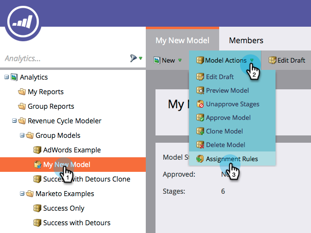

# Genehmigen von Phasen und Zuweisen von Leads zu einem Umsatzmodell {#approving-stages-and-assigning-leads-to-a-revenue-model}

Holen Sie sich **Umsatzmodell** durch Hinzufügen vorhandener Leads und Erstellen von Zuweisungsregeln für alle neuen Leads ausgeführt werden.

## Stadien werden genehmigt {#approving-stages}

Genehmigen wir die Phasen Ihres Modells, bevor Sie Leads hinzufügen.

1. Navigieren Sie zu **Analytics** Bereich.

   

1. Wählen Sie das Modell aus, dessen Etappen Sie validieren möchten.

   

1. under **Modellaktionen** auswählen **Phasen genehmigen**.

   

1. Sie werden mit einem Warnhinweis begrüßt. click **Leads zuweisen**.

   

Ausgezeichnet! Lassen Sie uns fortfahren und diese Leads zuweisen.

## Zuweisen vorhandener Leads {#assigning-existing-leads}

[Erstellen einer Smart-Liste](/help/marketo/product-docs/core-marketo-concepts/smart-lists-and-static-lists/creating-a-smart-list/create-a-smart-list.md) , um die Leads für eine Phase Ihres Modells in Ihrer Lead-Datenbank zu identifizieren.

1. Sobald du [Smart List erstellt haben](/help/marketo/product-docs/core-marketo-concepts/smart-lists-and-static-lists/creating-a-smart-list/create-a-smart-list.md), klicken Sie auf die **Leads** Registerkarte.

   

1. Klicken **Alle auswählen** , um die Leads auszuwählen.

   

1. Öffnen Sie die **Lead-Aktionen** und wählen Sie **Sonderaktion**. Klicken **Umsatzstufe ändern**.

   

1. Richtig auswählen **Modell** und der korrekten **Staging**. Klicken **Jetzt ausführen**.

   

1. Wiederholen Sie diese Schritte, bis alle Leads den verschiedenen Phasen Ihres Modells zugewiesen sind.

Sehr gut! Um festzulegen, wie neue Leads Bühnen zugewiesen werden, erstellen Sie Zuweisungsregeln.

>[!NOTE]
>
>Wenn sich Ihr Modell im Status &quot;Genehmigte Phasen&quot;befindet, werden in den Aktivitätsprotokollen der Leads keine Ereignisse vom Typ &quot;Umsatzstufe ändern&quot;angezeigt. Wenn Ihr Modell vollständig genehmigt ist, wird dieser Flussschritt übersprungen, wenn Sie einen Lead in dieselbe Phase verschieben, in der er sich derzeit befindet.

## Neue Leads: Erstellen von Zuweisungsregeln  {#new-leads-create-assignment-rules}

1. Klicken **Marketo - Startseite** Wählen Sie erneut **Analytics**.

   

1. Klicken Sie auf Ihr Modell in der Baumstruktur und dann auf das **Modellaktionen** Menü, auswählen **Zuweisungsregeln**.

   

1. Wenn Ihre Zuweisungsregeln mehr als nur eine Standardauswahl enthalten, klicken Sie auf **Staging**, wählen Sie Ihre Auswahl aus und klicken Sie auf **Auswahl hinzufügen**.

   

## Beispielzuweisungsregel {#example-assignment-rule}

Erstellen Sie eine Lead-Score-Regel, um die neuen Leads mit einem Mindestwert einem entsprechenden Schritt zuzuweisen.

1. under **Wenn** auswählen **Lead-Punktzahl**. Dann wählen Sie **mindestens**.

   

1. Eingabe **40** und wählen Sie **Vertriebsmitarbeiter** als Bühne. Klicken **Speichern** zu beenden.

   

>[!MORELIKETHIS]
>
>Um Ihr Modell zu genehmigen, lesen Sie unsere Hilfeseite unter **[Genehmigen und Aufheben der Genehmigung eines Umsatzmodells](/help/marketo/product-docs/reporting/revenue-cycle-analytics/revenue-cycle-models/approve-unapprove-a-revenue-model.md)**.
