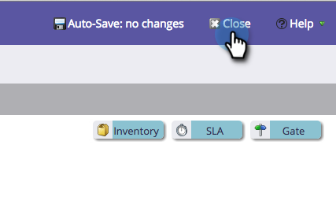

# Name eines Stadiums ändern {#changing-the-name-of-a-stage}

Ihre Meinung ändern? Kein Problem. Das Umbenennen eines Stadiums im Umsatzzyklusmodellierer ist einfach.

1. Wechseln Sie zum Bereich **[!UICONTROL Analytics]**.

   

1. Wählen Sie einen zu aktualisierenden Umsatzzyklusmodellierer aus. Klicken Sie **[!UICONTROL Entwurf bearbeiten]**.

   

1. Wählen Sie die Phase aus, die Sie aktualisieren möchten, und geben Sie einen neuen **[!UICONTROL Namen]** ein.

   

1. Klicken Sie auf **[!UICONTROL Schließen]**.

   

   Siehst du? Einfach! Denken Sie daran[ Ihr Modell zu ](/help/marketo/product-docs/reporting/revenue-cycle-analytics/revenue-cycle-models/approve-unapprove-a-revenue-model.md).
