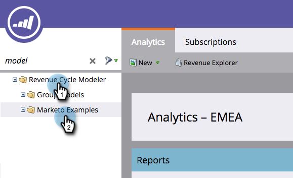

# Klonen eines Beispiel-Umsatzmodells in Marketo {#cloning-a-marketo-example-revenue-model}

Marketo verfügt über beispielhafte Umsatzmodellierer, die Sie inspirieren können. Klonen Sie diese Modellierer und machen Sie sie zu Ihren eigenen. So geht&#39;s:

1. Wechseln Sie zum Bereich **[!UICONTROL Analytics]**.

   

1. Wählen Sie **[!UICONTROL Ordner „Umsatzzyklus Modeler]** und klicken Sie auf **[!UICONTROL Marketo-Beispiele]**.

   

1. Wählen Sie einen der Modellierer.

   

1. Wählen [!UICONTROL &#x200B; in &quot;]&quot; die Option **[!UICONTROL Modell klonen]**.

   

1. Geben Sie einen **[!UICONTROL Namen]** ein und klicken Sie auf **[!UICONTROL Klonen]**.

   

   Wenn es doch nur so einfach wäre, Umsätze zu generieren!
