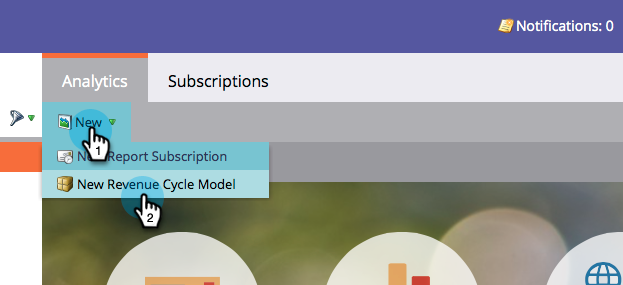

# Neues Umsatzmodell erstellen {#create-a-new-revenue-model}

1. Um ein neues Umsatzzyklusmodell zu erstellen, klicken Sie auf das **Analytics** auf der Startseite von My Marketo.

   

1. Im **Analytics** Registerkarte, klicken **Neu** und wählen **Neues Modell für Umsatzzyklen**.

   

1. A **Neues Modell für Umsatzzyklen** modales Fenster angezeigt. Geben Sie einen Namen ein und klicken Sie auf **Erstellen**.

   

1. Klicks **Entwurf bearbeiten** in der Startansicht Ihres Modells.

   

1. Im neuen Fenster wird Ihnen ein Modell mit sechs Inventarphasen, fünf Übergängen zwischen diesen Phasen und der Möglichkeit, Inventar-, SLA- und Gate-Bühnen hinzuzufügen.

   

Schärf aussehen! Sie sind gerade in die wunderbare Welt der Modellierung eingetreten.

>[!MORELIKETHIS]
>
>Weitere Informationen [Verwenden der Lagerbestandsstadien des Umsatzmodells](/help/marketo/product-docs/reporting/revenue-cycle-analytics/revenue-cycle-models/using-revenue-model-inventory-stages.md).
