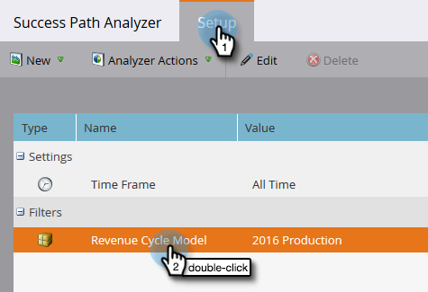
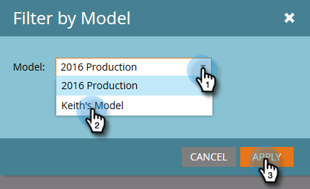

# Erstellen eines Erfolgspfad-Analyzers {#create-a-success-path-analyzer}

Zeigen Sie Geschwindigkeit und Fluss visuell durch Ihr [Umsatzzyklusmodell](http://docs.marketo.com/display/docs/revenue+cycle+analytics)an.

>[!PREREQUISITES]
>
>[Neues Umsatzmodell erstellen](create-a-new-revenue-model.md)

1. Klicken Sie auf die Kachel Analytics.

   

1. Klicken Sie auf das Symbol Erfolgspfadanalyse.

   

   >[!NOTE]
   >
   >Wenn Sie eine Warnung erhalten, dass im angegebenen Zeitraum keine Daten gefunden wurden, klicken Sie auf **Schließen** , um den Zeitraum zu ändern. Wenn Sie nicht aufgefordert werden, aber den Zeitraum ändern möchten, gehen Sie zu **Einrichtung** und klicken Sie mit der Dublette auf******Zeitraum**.

1. Wenn keine Daten vorhanden sind oder Sie den Zeitraum ändern, wählen Sie eine aus der Dropdownliste aus und klicken Sie auf Speichern.

   

   >[!TIP]
   >
   >Um einen bestimmten Bereich auszuwählen, wählen Sie &quot; **Benutzerdefiniert** &quot;und verwenden Sie die Felder &quot; **Von** &quot;und &quot; **Bis** &quot;.

1. Wenn Sie über mehr als ein Umsatzzyklusmodell verfügen, wählen Sie auf der Registerkarte &quot;Einstellungen&quot;das gewünschte Modell aus.

   

1. Wählen Sie das entsprechende Modell und klicken Sie auf Übernehmen.

   

1. Klicken Sie auf die Registerkarte Erfolgspfadanalyse.

   

Jetzt können Sie Bewegung von jeder Bühne bis zur nächsten erforschen!

>[!TIP]
>
>Willst du deinen Bericht speichern? Klicken Sie auf die Dropdownliste **Analyzer-Aktionen** und wählen Sie **Speichern unter**.

>[!NOTE]
>
>**Verwandte Artikel**
>
>* [Verwenden des Erfolgspfad-Analyzers](using-the-success-path-analyzer.md)

>

