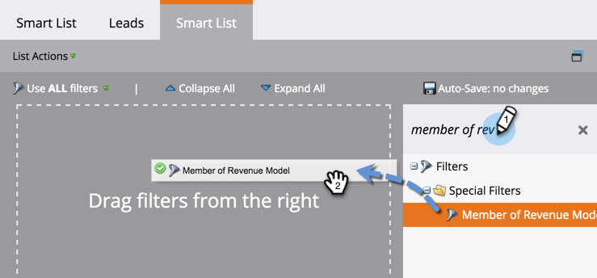
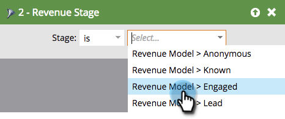
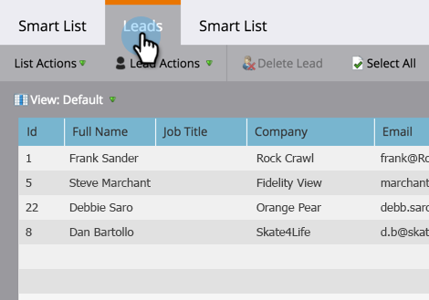

# Suchen nach allen Leads in einem Umsatzzyklusmodell {#find-all-leads-in-a-revenue-cycle-model}

Durch die Verwendung von Smart Lists können Sie alle Mitglieder des Umsatzzyklusmodells leicht finden.

>[!PREREQUISITES]
>
>[Erstellen einer Smart-Liste](/help/marketo/product-docs/core-marketo-concepts/smart-lists-and-static-lists/creating-a-smart-list/create-a-smart-list.md)

1. Klicken Sie bei ausgewählter Smart-Liste auf die Registerkarte **[!UICONTROL Smart-Liste]**.

   

1. Suchen Sie den **[!UICONTROL Mitglied des Umsatzmodells]** und ziehen Sie ihn auf die Arbeitsfläche.

   

1. Wählen Sie ein **[!UICONTROL Modell]** aus.

   

   Dadurch bekämen Sie alle Leads in diesem Modell, unabhängig von der Phase. Normalerweise ist ein bestimmter Schritt erforderlich. Verwenden Sie stattdessen den folgenden Filter.

1. Suchen Sie den Filter **[!UICONTROL Umsatzstufe]** und ziehen Sie ihn auf die Arbeitsfläche.

   

1. Wählen Sie ein **[!UICONTROL Stadium]**.

   

1. Gehen Sie zur Registerkarte **[!UICONTROL Leads]**, um die Ergebnisse anzuzeigen.

   

   >[!TIP]
   >
   >Sie benötigen nicht beide Filter, wählen Sie einfach den gewünschten Filter aus. Wir zeigen Ihnen nur, dass Sie beide gründlich sind.

   >[!CAUTION]
   >
   >Wenn der Schritt eines Leads durch eine externe Kampagne während der ersten Erstellung des Leads geändert wird, wird eine Aktivität nicht in der Datenbank protokolliert. Das bedeutet, dass der Lead nicht in den Filter der Smart-Liste aufgenommen wird.
