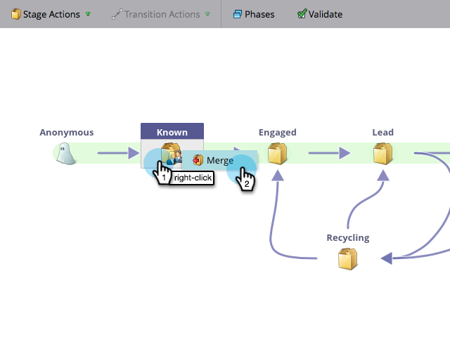

# Zusammenführen von zwei Phasen in der Umsatz-Modeler {#merging-two-stages-in-the-revenue-modeler}

Nachdem Sie das Modell genehmigt haben, können Sie beim Bearbeiten eines Entwurfs keine Phasen löschen. Stattdessen können Sie diese Phase mit einer anderen zusammenführen.

1. Klicken Sie auf **Marketo-Startseite** und wählen Sie **Analytics** aus.

   

1. Klicken Sie auf Ihr genehmigtes Modell.

   

1. Klicken Sie auf **Entwurf bearbeiten.**

   

1. Klicken Sie mit der rechten Maustaste auf die Phase, die Sie zusammenführen möchten, und wählen Sie im Menü **Phase zusammenführen** aus.

   

1. Klicken Sie in der Pulldown-Liste auf die jeweilige Phase.

   

1. Sie können das Modell erneut genehmigen, indem Sie im Menü **Modellaktionen** die Option **Modellentwurf genehmigen** auswählen.

   

>[!NOTE]
>
>Wählen Sie **None** aus dem Pulldown der Zusammenführungsstufe, um die Leads aus Ihrem Modell zu entfernen.
