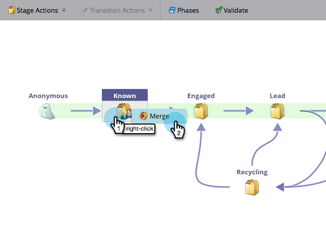

# Zusammenführen von zwei Phasen im Umsatz-Modeler {#merging-two-stages-in-the-revenue-modeler}

Nachdem Sie das Modell genehmigt haben, können Sie beim Bearbeiten eines Entwurfs keine Phasen löschen. Stattdessen können Sie diese Phase mit einer anderen zusammenführen.

1. Klicken Sie auf **Marketo** Startseite und wählen Sie **[!UICONTROL Analytics]**.

   

1. Klicken Sie auf das genehmigte Modell.

   

1. Klicken Sie **[!UICONTROL Entwurf bearbeiten.]**

   

1. Klicken Sie mit der rechten Maustaste auf die Phase, die Sie zusammenführen möchten, und wählen Sie **[!UICONTROL Zusammenführen] Phase** im Menü aus.

   

1. Klicken Sie auf die jeweilige Phase in der Pulldown-Liste.

   

1. Sie können das Modell erneut genehmigen, indem Sie **[!UICONTROL Modellentwurf genehmigen]** im Menü **[!UICONTROL Modellaktionen]** auswählen.

   

>[!NOTE]
>
>Wählen Sie **[!UICONTROL Keine]** in der [!UICONTROL Zusammenführungsphase] aus, um die Leads aus Ihrem Modell zu entfernen
