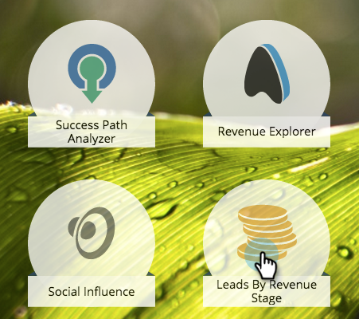

# Berichte zu Ihrem Umsatzmodell {#report-on-your-revenue-model}

Für jedes Umsatzzyklusmodell können Sie einen Bericht darüber generieren, wie viele Leads in den einzelnen Phasen vorhanden sind.

>[!NOTE]
>
>Leads müssen Mitglieder des Modells sein, damit sie in den Bericht aufgenommen werden können.

1. Navigieren Sie zu **[!UICONTROL Analytics]**.

   

1. Klicken Sie **[!UICONTROL Leads nach Umsatzstufe]**.

   

1. Klicken Sie auf die **[!UICONTROL Setup]** und doppelklicken Sie dann unter dem Filterabschnitt auf **[!UICONTROL Umsatzzyklusmodell]**.

   

1. Wählen Sie das genehmigte **[!UICONTROL Modell]** aus.

   

   >[!NOTE]
   >
   >Um in diesem Dropdown-Menü verfügbar zu sein, muss das Modell genehmigt sein oder mindestens über genehmigte Phasen verfügen.

1. Klicken Sie auf **[!UICONTROL Bericht]**, um anzuzeigen, wie viele Leads sich in den einzelnen Phasen Ihres Umsatzzyklusmodells befinden.

   

Warum ist das nützlich? Das Modell zeigt Ihre Vertriebs- und Marketing-funnel. Verfolgen Sie ihre Salden im Laufe der Zeit, um Engpässe zu identifizieren, bevor sie zu einem Problem werden.
