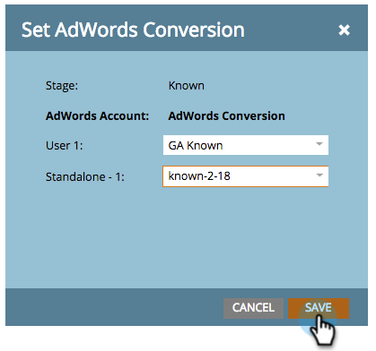

# Festlegen von Google AdWords-Konversionen im Umsatzmodell mit einem Manager-Konto {#set-google-adwords-conversions-in-the-revenue-model-with-a-manager-account}

Verknüpfen Sie Ihr Google AdWords-Konto mit Marketo, um Offline-Konversionsdaten automatisch von Marketo in Google AdWords hochzuladen. In der AdWords-Benutzeroberfläche können Sie dann leicht erkennen, welche Klicks zu qualifizierten Leads, Chancen und neuen Kunden (oder welchen Umsatzstadien Sie nachverfolgen möchten) geführt haben, nachdem Sie in AdWords [benutzerdefinierte Spalten hinzufügen](https://support.google.com/adwords/answer/3073556) hinzugefügt haben.

Wenn Sie über mehrere Google AdWords-Konten verfügen, können Sie ein [Google AdWords Manager-Konto](https://www.google.com/adwords/manager-accounts/) (ehemals „Mein Client-Center„) verwenden, um sie in Marketo zu integrieren.

Sie können Offline-Konversionen von AdWords einem oder mehreren Phasen in einem Umsatzmodell zuordnen. Es gibt zwei Möglichkeiten:

* Bühnenaktion
* AdWords-Zuordnung

>[!PREREQUISITES]
>
>[Fügen Sie Google AdWords als Launchpoint-Service mit einem Manager-Konto hinzu](/help/marketo/product-docs/administration/additional-integrations/add-google-adwords-as-a-launchpoint-service-with-a-manager-account.md)

## Staging-Aktion verwenden {#use-stage-action}

Ordnen Sie eine AdWords-Konversion unter Staging-Aktionen zu.

1. Wählen Sie den Schritt aus, den Sie einer AdWords-Konversion zuordnen möchten.

   

1. Wählen Sie in **Dropdown** Liste „Staging-Aktionen“ die Option **AdWords-Konversion festlegen**.

   

1. Legen Sie eine **AdWords-Konversion** fest.

   >[!NOTE]
   >
   >Für jedes untergeordnete Konto kann eine andere AdWords-Konversion ausgewählt werden.

   

   Tipp: Wenn Sie noch keine AdWords-Konversionen haben, erstellen Sie eine, indem Sie auf **+Neue Konversion klicken**.

   

1. Klicken Sie auf **Speichern**.

   

1. Nachdem Sie alle AdWords-Konversionen den Umsatzstadien zugeordnet haben, gehen Sie zurück zur Zusammenfassungsseite. Wählen Sie **Modellaktionen** und wählen Sie **Phasen genehmigen**.

   

## Profi-Tipp: Neue Konversion hinzufügen {#pro-tip-add-a-new-conversion}

Pro Tipp! Aus Marketo kann eine neue AdWords-Offline-Konversion erstellt werden.

>[!CAUTION]
>
>Bei neuen Konversionen, die aus Marketo erstellt wurden, ist die Einstellung „Optimierung“ aktiviert. Dies bedeutet, dass AdWords-Bid-Strategien Ihre Angebote für diese Konversionen optimieren können. Sie können diese Einstellung über Ihr AdWords-Konto ändern.

1. Wählen Sie in **Dropdown** Liste „Staging-Aktionen“ die Option **AdWords-Konversion festlegen**.

   

1. Wählen Sie **Neue Konversion** aus.

   

1. Geben Sie einen **Konversionsnamen** ein. Klicken Sie auf **Speichern**.

   

   Ausgezeichnet! Diese neue Konversion wird in Ihrem AdWords-Konto angezeigt.

## AdWords-Zuordnung verwenden {#use-adwords-mapping}

Mit AdWords-Mappings können Sie alle Modellphasen mit Ihrer AdWords-Konversion an einem Ort verknüpfen.

1. Wählen Sie **AdWords-Zuordnungen bearbeiten** aus.

   

1. Wählen Sie für jeden Schritt **den Sie nachverfolgen möchten, das gewünschte** AdWords-Konto **und die gewünschte „AdWords-Konversion** aus.

   

1. Klicken Sie nach der Zuordnung Ihrer Stadien auf **Speichern**.

   

1. Nachdem Sie alle AdWords-Konversionen den Umsatzstadien zugeordnet haben, gehen Sie zurück zur Zusammenfassungsseite. Wählen Sie **Modellaktionen** und wählen Sie **Phasen genehmigen**.

   

Um die Offline-Konversionsdaten anzeigen zu können, müssen Sie sich bei Ihrem AdWords-Konto anmelden. Es wird empfohlen, die Funktion [Benutzerdefinierte Spalten](https://support.google.com/adwords/answer/3073556) zu verwenden, um für jede Offline-Konversion, die Sie aus Marketo importieren, Spalten für die Konversionsanzahl zu erstellen.
