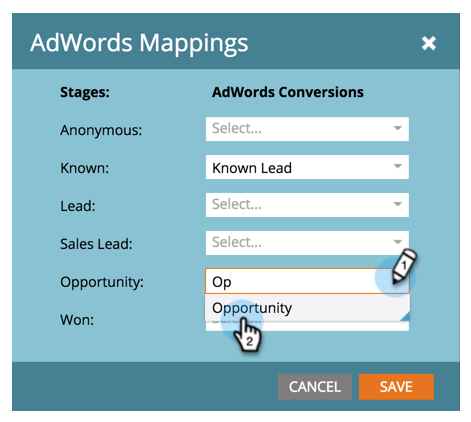

# Festlegen von Google AdWords-Konversionen im Umsatzmodell {#set-google-adwords-conversions-in-the-revenue-model}

Verknüpfen Sie Ihr Google AdWords-Konto mit Marketo, um Offline-Konversionsdaten automatisch von Marketo in Google AdWords hochzuladen. Anschließend können Sie in der AdWords-Benutzeroberfläche einfach sehen, welche Klicks zu qualifizierten Leads, Chancen und neuen Kunden (oder welchen Umsatzstufen Sie verfolgen möchten) führten, nachdem Sie [benutzerdefinierte Spalten hinzufügen](https://support.google.com/adwords/answer/3073556) in AdWords hinzugefügt haben.

>[!NOTE]
>
>Dies ist eine Push-Integration von Marketo in Google AdWords. Konversionsdaten werden _nur_ in Ihrem Google AdWords-Portal angezeigt, _nicht in der Marketo-Benutzeroberfläche_.

Erfahren Sie mehr über die Funktion von [Google für den Offline-Konversionsimport](https://support.google.com/adwords/answer/2998031?hl=en). Ordnen Sie AdWords-Offline-Konversionen einer oder mehreren Phasen in einem Umsatzmodell zu. Es gibt drei Möglichkeiten, die Zuordnung vorzunehmen:

* AdWords-Conversion
* Staging-Aktion
* AdWords-Zuordnung

Sie können eine neue AdWords-Offline-Konversion aus Marketo erstellen, wenn Sie die Staging-Aktion verwenden.

>[!PREREQUISITES]
>
>[Hinzufügen von Google AdWords als LaunchPoint-Dienst](/help/marketo/product-docs/administration/additional-integrations/add-google-adwords-as-a-launchpoint-service.md)

## Verwenden der AdWords-Konversion {#use-adwords-conversion}

1. Wechseln Sie zum Bereich **Analytics** .

   

1. Wählen Sie ein Modell aus.

   

1. Klicken Sie auf **Entwurf bearbeiten**.

   

1. Wählen Sie die Umsatzstufe aus, die Sie einer AdWords-Konversion zuordnen möchten.

   

1. Wählen Sie die **AdWords Conversion** aus, die Sie Ihrer Marketo-Bühne zuordnen möchten.

   

   Gut! Ihre AdWords-Konversionsdaten werden zu dem von Ihnen ausgewählten Zeitpunkt in Ihre Google AdWords hochgeladen.

## Verwenden der Staging-Aktion {#use-stage-action}

Sie können eine AdWords-Konversion auch unter &quot;Staging-Aktionen&quot;zuordnen.

1. Wählen Sie den Schritt aus, den Sie einer AdWords-Konversion zuordnen möchten.

   

1. Wählen Sie unter der Dropdown-Liste **Staging-Aktionen** die Option **AdWords-Konversion festlegen** aus.

   

1. Wählen Sie eine **AdWords-Konversion** aus.

   

   **Tipp**: Wenn Sie keine AdWords-Konversionen haben, erstellen Sie eine, indem Sie auf **+Neue Konversion** klicken.

   

1. Klicken Sie auf **Speichern**.

   

1. Nachdem Sie alle AdWords-Konversionen den Umsatzphasen zugeordnet haben, gehen Sie zurück zur Zusammenfassungsseite. Wählen Sie **Modellaktionen** und dann **Phasen genehmigen** aus.

   

## Pro Tipp: Neue Konversion hinzufügen {#pro-tip-add-a-new-conversion}

Pro Tipp! Eine neue AdWords-Offline-Konversion kann über Marketo erstellt werden.

>[!CAUTION]
>
>Bei neuen Konversionen, die aus Marketo erstellt wurden, ist die Einstellung &quot;Optimierung&quot;aktiviert. Das bedeutet, dass AdWords-Angebotsstrategien Ihre Angebote für diese Konversionen optimieren können. Sie können diese Einstellung in Ihrem AdWords-Konto ändern.

1. Wählen Sie unter der Dropdown-Liste **Staging-Aktionen** die Option **AdWords-Konversion festlegen** aus.

   

1. Wählen Sie **Neue Konversion** aus.

   

1. Geben Sie einen **Konversionsnamen** ein. Klicken Sie auf **Speichern**.

   

   Ausgezeichnet! Diese neue Konversion wird in Ihrem AdWords-Konto angezeigt.

## Verwenden der AdWords-Zuordnung {#use-adwords-mapping}

Sie können alle Ihre Modellphasen mit Ihrer AdWords-Konversion an einem Ort mithilfe von AdWords-Zuordnungen verknüpfen.

1. Wählen Sie **AdWords-Zuordnungen bearbeiten** aus.

   

1. Wählen Sie die gewünschte **AdWords Conversion** für jede Phase aus, die Sie verfolgen möchten.

   

1. Nachdem Sie Ihre Bühnen zugeordnet haben, klicken Sie auf **Speichern**.

   

1. Nachdem Sie alle AdWords-Konversionen den Umsatzphasen zugeordnet haben, gehen Sie zurück zur Zusammenfassungsseite. Wählen Sie **Modellaktionen** und dann **Phasen genehmigen** aus.

   

Um die Offline-Konversionsdaten anzuzeigen, müssen Sie sich bei Ihrem AdWords-Konto anmelden. Es wird empfohlen, die Funktion [Benutzerdefinierte Spalten](https://support.google.com/adwords/answer/3073556) zu verwenden, um Konversionszählungsspalten für jede Offline-Konversion zu erstellen, die Sie aus Marketo importieren.
