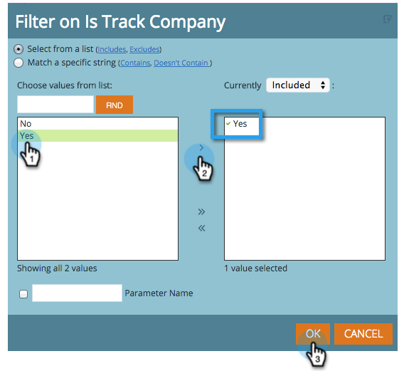

# Beginnen mit dem Tracking nach Konto im Umsatz-Modeler {#start-tracking-by-account-in-the-revenue-modeler}

Mit der Umsatzstufe Modeler und dem [!UICONTROL Umsatz-Explorer] können Sie insight bei der Performance Ihrer Leads und Konten gewinnen, während diese Ihr Modell durchlaufen.

>[!NOTE]
>
>Stellen Sie sicher, dass bei Ihrem genehmigten Modell die Phasen auf dem Erfolgspfad mit der Option **Tracking nach Konto starten** aktiviert sind.

1. Nachdem ausreichend Zeit verstrichen ist, um nützliche Daten zu erfassen, wählen Sie **[!UICONTROL Umsatz-Explorer]** unter **Meine Marketo-Startseite** aus.

   

1. Um einen neuen Bericht zu erstellen, klicken Sie auf **[!UICONTROL Datei]** und wählen Sie **[!UICONTROL Neu]** dann **[!UICONTROL Bericht]**.

   

1. Wählen Sie **[!UICONTROL Modellleistungsanalyse (Unternehmen)]** als Analysebereich aus und klicken Sie auf **[!UICONTROL OK]**.

   

1. Es wird empfohlen, die Felder **[!UICONTROL Phase]**, **[!UICONTROL Monat]** und **[!UICONTROL Endsaldo]** zu ziehen, um den Fortschritt der Unternehmen durch Ihr Modell nach Monat anzuzeigen. Verwenden Sie Filter, um die gewünschten Monate auszuwählen.

   

1. Wenn Sie Ihren Bericht fertig eingerichtet haben, klicken Sie mit der rechten Maustaste auf **[!UICONTROL Ist Firma nachverfolgen]** und wählen Sie **[!UICONTROL Filter]**. Damit beschränken wir den Bericht auf die Phasen, in denen **Tracking nach Konto** ausgewählt ist.

   

1. Wählen Sie im angezeigten Dialogfeld die Option **[!UICONTROL Ja]** und klicken Sie in der Mitte auf den nach rechts zeigenden Pfeil. Dadurch werden nur die Phasen gefiltert, für die „Tracking nach Konto“ aktiviert ist. Klicken Sie **[!UICONTROL auf]**, wenn Sie fertig sind.

   

1. Ihr Bericht sollte jetzt nur noch die Phasen anzeigen, die Sie nach Konto verfolgen. Speichern Sie den Bericht, damit Sie ihn später verwenden können. Jetzt können Sie dies als ein weiteres Maß für den Erfolg Ihrer Marketing-Bemühungen verwenden.
