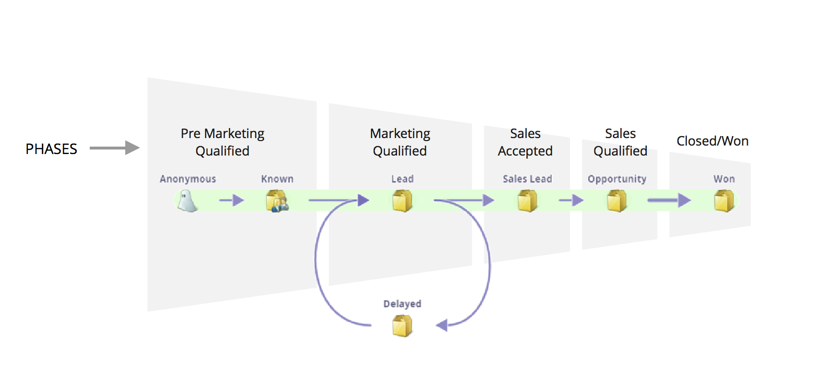

# Grundlegendes zu den Phasen des Umsatzmodells {#understanding-revenue-model-phases}

Phasen sind eine Möglichkeit, eine Reihe von Phasen zu gruppieren. Manchmal spiegeln mehrere Phasen in einem Modell eine Phase einer funnel wider.

## Definieren der Phasen des Modells {#define-the-phases-of-the-model}

1. Klicken Sie auf **[!UICONTROL Phasen]**.

   

1. Klicken Sie auf die blaue Schaltfläche, um die Phasen durch die Stadien nach oben und unten zu ziehen.

   
