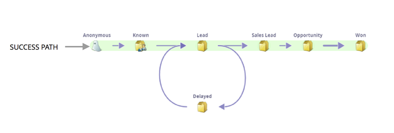

# Grundlegendes zum Erfolgspfad eines Umsatzmodells {#understanding-revenue-model-success-path}

## Erfolgspfad {#success-path}

Im Modell ist der grüne Pfad, auch **Erfolgspfad** der optimale Pfad, wie ein Lead linear zu einem geschlossenen/gewonnenen Unternehmen übergeht.

Beispielphasen auf einem Erfolgspfad:

| **NAME DER ERFOLGSPFADPHASE** | **DEFINITION** |
|---|---|
| **Neue Namen überprüfen** | Überprüfen, ob neue Namen qualifiziert sind |
| **Interessent** | Qualifizierte Interessenten, die noch nicht verkaufsbereit sind |
| **Lead** | Vom Marketing qualifizierte Leads („verkaufsbereit„) |
| **Opportunity** | Vom Verkauf akzeptierte Leads, aktiv arbeitend |
| **Kunde** | Abgeschlossene gewonnene Angebote |

>[!TIP]
>
>Grün ist für Geld. Alles auf dem Weg der Grünen ist auf dem Weg zum Erfolg! Aus diesem Grund gibt es nur grüne Pfeile im [Success Path Analyzer](using-the-success-path-analyzer.md).

## Umwege {#detours}

Da nicht alle Leads einem linearen „Erfolgspfad“ folgen, sollten Sie auch Ihre „Umleitungsstadien“ definieren, um Leads zu erfassen, die nicht qualifiziert sind oder die erst nach einigen Pflegerunden bereit sein müssen. Beispiel:

| **NAME DER UMLEITUNGSPHASE** | **DEFINITION** |
|---|---|
| **disqualifiziert** | Namen, die als nicht im Profil enthalten gekennzeichnet sind |
| **Inaktiv** | Interessenten, die nicht mehr reagieren |
| **Recycelt** | Qualifiziert, aber mit verstärkter Betreuung (in Verbindung mit dem potenziellen Kunden) |
| **Verloren** | Verlorene Chancen (fortlaufende Pflege) |

>[!TIP]
>
>Diese sind nicht auf dem grünen Weg. Diese Phasen werden nicht im Erfolgspfad-Analyzer angezeigt.

So viel einfacher wird es sein zu sehen, wie Leads in Zukunft fließen werden! Grüß deinen neuen kleinen Freund.
