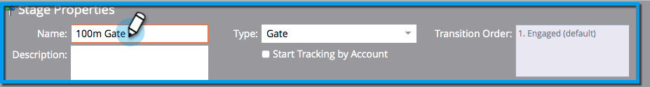

# Verwenden von Gate-Phasen für Umsatzmodelle {#using-revenue-model-gate-stages}

Eine Gate-Stufe dient als Qualifizierungsprüfung.

>[!TIP]
>
>Es ist eine gute Idee, ein Übungsmodell in einem Grafik- oder Präsentationsprogramm zu erstellen und es mit Ihren Kollegen zu bestätigen.

## Hinzufügen einer Gate-Phase {#add-a-gate-stage}

1. Wechseln Sie zum Bereich **Analytics** .

   

1. Wählen Sie ein vorhandenes Modell aus oder [erstellen Sie ein neues](/help/marketo/product-docs/reporting/revenue-cycle-analytics/revenue-cycle-models/create-a-new-revenue-model.md).

   

1. Klicken Sie auf **Entwurf bearbeiten**.

   

1. Klicken Sie auf die Schaltfläche **Gate** und ziehen Sie dann eine beliebige Stelle auf der Arbeitsfläche.

   

1. Bearbeiten Sie den **Namen** und wählen Sie einen **Typ** aus.

   >[!NOTE]
   >
   >Wählen Sie zu diesem Zeitpunkt [Tracking nach Konto starten](/help/marketo/product-docs/reporting/revenue-cycle-analytics/revenue-cycle-models/start-tracking-by-account-in-the-revenue-modeler.md) aus, um Einblicke in die Leistung Ihrer Konten zu erhalten, während sie durch Ihr Modell laufen.

   

>[!NOTE]
>
>Die Gate Stage teilt Leads basierend auf Kriterien auf, die Sie in die Übergangsregeln eingeben. **Sie enthält keine Leads.** Eine Standardtransition ist erforderlich, damit Leads, die nicht von den anderen Transitionen ausgewählt werden, den Standard durchlaufen.

## Eine Gate-Phase bearbeiten {#edit-a-gate-stage}

Bearbeiten Sie den Namen und die Beschreibung und passen Sie den Typ Ihrer Gate-Phase an. Sie können auch die Option [Tracking mit Konto starten](/help/marketo/product-docs/reporting/revenue-cycle-analytics/revenue-cycle-models/start-tracking-by-account-in-the-revenue-modeler.md) auswählen.

1. Klicken Sie auf ein Staging-Symbol für **Gate**.

   

1. Klicken Sie in die Felder **Name** und **Beschreibung**, um ihren Inhalt zu bearbeiten.

   

1. Wählen Sie das Dropdown-Menü **Typ** aus, um es zu bearbeiten.

   

## Eine Gate-Phase löschen {#delete-a-gate-stage}

1. Sie können eine Gate Stage löschen, indem Sie mit der rechten Maustaste auf das Gate Stage-Symbol klicken und **Löschen** auswählen.

   

1. Sie können eine Gate-Phase auch löschen, indem Sie darauf klicken und dann in der Dropdown-Liste **Staging-Aktionen** die Option **Löschen** auswählen.

   

1. Bei beiden Löschmethoden müssen Sie Ihre Auswahl bestätigen. Klicken Sie auf **Löschen**.

   

Herzlichen Glückwunsch! Jetzt verstehen Sie die wunderbare Welt der Gate Stages.

>[!MORELIKETHIS]
>
>* [Verwenden der Lagerbestandsstatus des Umsatzmodells](/help/marketo/product-docs/reporting/revenue-cycle-analytics/revenue-cycle-models/using-revenue-model-inventory-stages.md)
>* [Verwenden von SLA-Phasen des Umsatzmodells](/help/marketo/product-docs/reporting/revenue-cycle-analytics/revenue-cycle-models/using-revenue-model-sla-stages.md)
>* [Erstellen Sie ein neues Umsatzmodell](/help/marketo/product-docs/reporting/revenue-cycle-analytics/revenue-cycle-models/create-a-new-revenue-model.md).
