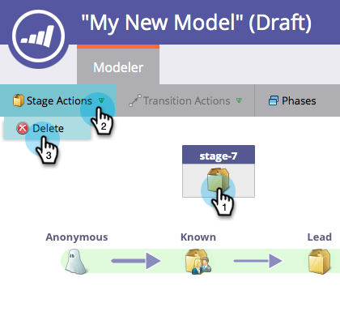

# Verwenden der Lagerbestandsstadien des Umsatzmodells {#using-revenue-model-inventory-stages}

Alle bekannten Leads und Konten befinden sich zunächst in der Lagerbestandsbühne. In diesem Interessenten-Pool werden Leads gepflegt, bis sie zum Verkauf bereit sind. Für eine Inventarphase gibt es keine Zeitbeschränkung.

>[!TIP]
>
>Es ist eine gute Idee, ein Übungsmodell in einem Grafik- oder Präsentationsprogramm zu erstellen und es zuerst mit Ihren Kollegen zu bestätigen.

## Hinzufügen einer Lagerbestandsstufe {#add-an-inventory-stage}

1. Um eine neue Phase des Inventars des Umsatzzyklusmodells hinzuzufügen, klicken Sie auf die Schaltfläche **Analytics** auf der Startseite von **My Marketo** .

   

1. Wählen Sie im Abschnitt **Analytics** das vorhandene Modell aus oder erstellen Sie [ein neues Modell](/help/marketo/product-docs/reporting/revenue-cycle-analytics/revenue-cycle-models/create-a-new-revenue-model.md).

   

1. Klicken Sie auf **Entwurf bearbeiten**.

   

1. Um eine neue Lagerbestandsstufe hinzuzufügen, klicken Sie auf die Schaltfläche **Bestand** und ziehen Sie sie per Drag &amp; Drop an eine beliebige Stelle auf der Arbeitsfläche.

   

1. Sie können den Namen bearbeiten, eine Beschreibung hinzufügen und den Typ nach dem Hinzufügen einer Bühne anpassen. Sie können derzeit auch **[Tracking nach Konto starten](/help/marketo/product-docs/reporting/revenue-cycle-analytics/revenue-cycle-models/start-tracking-by-account-in-the-revenue-modeler.md)** auswählen.

   

## Eine Lagerbestandsstufe bearbeiten {#edit-an-inventory-stage}

Wenn Sie ein Symbol &quot;Bestand&quot;auswählen, können Sie den **Namen** bearbeiten, eine **Beschreibung** hinzufügen oder den **Typ** anpassen. Sie können auch [Tracking nach Konto starten](/help/marketo/product-docs/reporting/revenue-cycle-analytics/revenue-cycle-models/start-tracking-by-account-in-the-revenue-modeler.md) auswählen.

1. Klicken Sie auf das Symbol Bestand .

   

1. Klicken Sie in die Felder **Name** und **Beschreibung**, um ihren Inhalt zu bearbeiten.

   

1. Wählen Sie den Pulldown **Typ** aus, um ihn zu bearbeiten.

   

## Eine Lagerbestandsstufe löschen {#delete-an-inventory-stage}

1. Sie können eine Lagerbestands-Phase löschen, indem Sie mit der rechten Maustaste auf ein Symbol für eine Lagerbestandsstufe klicken oder diese steuern.

   

1. Sie können eine Bühne auch löschen, indem Sie darauf klicken und dann im Dropdown-Menü **Staging-Aktionen** die Option **Löschen** auswählen.

   

1. Bei beiden Löschmethoden müssen Sie Ihre Auswahl bestätigen. Klicken Sie auf **Löschen**.

   

Herzlichen Glückwunsch! Jetzt verstehen Sie die wunderbare Welt der Inventarstadien.
