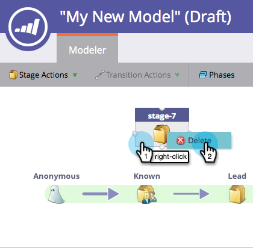

# Verwenden der Umsatzmodell-Inventarphasen {#using-revenue-model-inventory-stages}

Alle bekannten Leads und Konten befinden sich zunächst im Inventar-Stadium. In diesem Interessenten-Pool werden die Leads so lange gepflegt, bis sie für den Verkauf bereit sind. Es gibt keine Zeitbeschränkung für eine Inventarphase.

>[!TIP]
>
>Es empfiehlt sich, ein Übungsmodell in einem Grafik- oder Präsentationsprogramm zu erstellen und es zunächst mit den Kollegen zu bestätigen.

## Hinzufügen einer Inventarphase {#add-an-inventory-stage}

1. Um eine neue Phase des Inventars des Umsatzzyklusmodells hinzuzufügen, klicken Sie auf die Schaltfläche **[!UICONTROL Analytics]** im Startbildschirm **[!UICONTROL My Marketo]**.

   

1. Wählen **[!UICONTROL im Abschnitt]** Ihr vorhandenes Modell aus oder [erstellen Sie ein neues](/help/marketo/product-docs/reporting/revenue-cycle-analytics/revenue-cycle-models/create-a-new-revenue-model.md).

   

1. Klicken Sie **[!UICONTROL Entwurf bearbeiten]**.

   

1. Um eine neue Inventarphase hinzuzufügen, klicken Sie auf die Schaltfläche **[!UICONTROL Inventar]** und ziehen und lassen Sie sie dann an eine beliebige Stelle auf der Arbeitsfläche los.

   

1. Sie können den **[!UICONTROL Name]** bearbeiten, eine **[!UICONTROL Beschreibung]** hinzufügen und den **[!UICONTROL Typ]** nach dem Hinzufügen eines Schritts anpassen. Sie können zu diesem Zeitpunkt auch **[[!UICONTROL Tracking nach Konto starten]](/help/marketo/product-docs/reporting/revenue-cycle-analytics/revenue-cycle-models/start-tracking-by-account-in-the-revenue-modeler.md)** auswählen.

   

## Bearbeiten eines Inventarschritts {#edit-an-inventory-stage}

Wenn Sie ein Inventarsymbol auswählen, können Sie den **[!UICONTROL Name]** bearbeiten, eine **[!UICONTROL Beschreibung]** hinzufügen oder den **[!UICONTROL anpassen]**. Sie können auch [[!UICONTROL Tracking nach Konto starten]](/help/marketo/product-docs/reporting/revenue-cycle-analytics/revenue-cycle-models/start-tracking-by-account-in-the-revenue-modeler.md) auswählen.

1. Klicken Sie auf **[!UICONTROL Symbol]** Inventar“.

   

1. Klicken Sie in die Felder **[!UICONTROL Name]** und **[!UICONTROL Beschreibung]**, um ihren Inhalt zu bearbeiten.

   

1. Wählen Sie die Pulldown **[!UICONTROL Liste „Typ]** aus, um sie zu bearbeiten.

   

## Löschen einer Inventarphase {#delete-an-inventory-stage}

1. Sie können ein Lagerstadium löschen, indem Sie mit der rechten Maustaste oder mit der rechten Maustaste auf ein Lagerstadiensymbol klicken.

   

1. Sie können ein Stadium auch löschen, indem Sie darauf klicken und dann in der Dropdown **[!UICONTROL Liste &quot;]**&quot; die Option **[!UICONTROL Löschen]** auswählen.

   

1. Bei beiden Löschmethoden werden Sie aufgefordert, Ihre Auswahl zu bestätigen. Klicken Sie auf **[!UICONTROL Löschen]**.

   

Herzlichen Glückwunsch! Jetzt verstehen Sie die wunderbare Welt der Inventar-Stadien.
