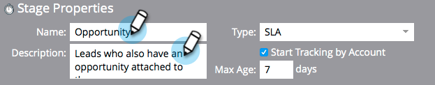

# Verwenden der Umsatzmodell-SLA-Phasen {#using-revenue-model-sla-stages}

SLA steht für &quot;service level agreement&quot;. Diese Phasen werden verwendet, wenn eine definierte maximale Zeit besteht, in der ein Lead ausgewertet oder verarbeitet werden muss, bevor der Prozess fortgesetzt oder beendet wird.

>[!TIP]
>
>Es empfiehlt sich, ein Übungsmodell in einem Grafik- oder Präsentationsprogramm zu erstellen und es mit den Kollegen zu bestätigen.

## SLA-Schritt hinzufügen {#add-an-sla-stage}

1. Um ein neues Stadium des Umsatzzyklusmodells SLA hinzuzufügen, klicken Sie auf die Schaltfläche **[!UICONTROL Analytics]** im Startbildschirm [!UICONTROL My Marketo].

   

1. Wählen [!UICONTROL &#x200B; im Abschnitt &#x200B;] Ihr vorhandenes Modell aus oder [erstellen Sie ein neues](/help/marketo/product-docs/reporting/revenue-cycle-analytics/revenue-cycle-models/create-a-new-revenue-model.md).

   

1. Klicken Sie **[!UICONTROL Entwurf bearbeiten]**.

   

1. Um einen neuen SLA-Schritt hinzuzufügen, klicken Sie auf die Schaltfläche **[!UICONTROL SLA]** und ziehen und lassen Sie ihn dann an eine beliebige Stelle auf der Arbeitsfläche los.

   

1. Sie können den **[!UICONTROL Name]** bearbeiten, eine **[!UICONTROL Beschreibung]** hinzufügen und den **[!UICONTROL Typ]** nach dem Hinzufügen eines Schritts anpassen. Sie können zu diesem Zeitpunkt auch **[[!UICONTROL Tracking nach Konto starten]](/help/marketo/product-docs/reporting/revenue-cycle-analytics/revenue-cycle-models/start-tracking-by-account-in-the-revenue-modeler.md)** auswählen.

   

## SLA-Phase bearbeiten {#edit-an-sla-stage}

Wenn Sie ein SLA-Staging-Symbol auswählen, können Sie den **[!UICONTROL Name]** bearbeiten, eine **[!UICONTROL Beschreibung]** hinzufügen und den **[!UICONTROL anpassen]**. Sie können auch [[!UICONTROL Tracking nach Konto starten]](/help/marketo/product-docs/reporting/revenue-cycle-analytics/revenue-cycle-models/start-tracking-by-account-in-the-revenue-modeler.md) auswählen.

1. Klicken Sie auf ein SLA-Staging-Symbol.

   

1. Klicken Sie in die Felder **[!UICONTROL Name]** und **[!UICONTROL Beschreibung]**, um ihren Inhalt zu bearbeiten.

   

1. Wählen Sie die **[!UICONTROL Typ]** aus, um sie zu bearbeiten.

   

## Löschen eines SLA-Schritts {#delete-an-sla-stage}

1. Sie können ein SLA-Stadium löschen, indem Sie mit der rechten Maustaste oder mit der rechten Maustaste auf ein SLA-Stadiensymbol klicken.

   

1. Sie können ein Stadium auch löschen, indem Sie darauf klicken und dann in der Dropdown **[!UICONTROL Liste &quot;]**&quot; die Option **[!UICONTROL Löschen]** auswählen.

   
