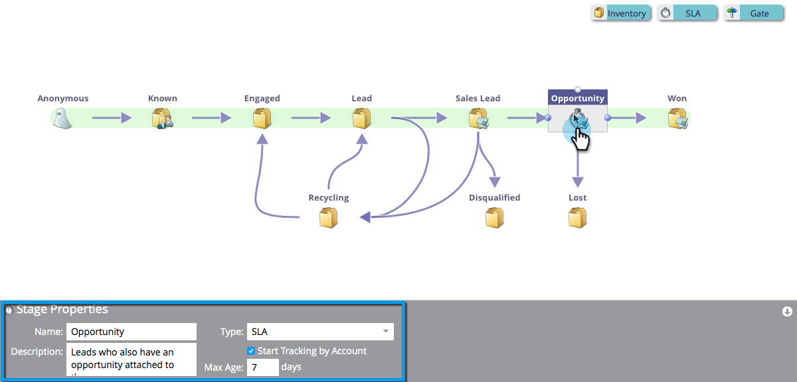

# Verwenden von SLA-Phasen für Umsatzmodelle {#using-revenue-model-sla-stages}

SLA steht für &quot;Service Level Agreement&quot;. Diese Phasen werden verwendet, wenn eine definierte maximale Zeitspanne vorliegt, in der ein Lead ausgewertet oder verarbeitet werden muss, bevor er vorwärts oder aus dem Prozess verschoben wird.

>[!TIP]
>
>Es ist eine gute Idee, ein Übungsmodell in einem Grafik- oder Präsentationsprogramm zu erstellen und es mit Ihren Kollegen zu bestätigen.

## SLA-Bühne hinzufügen {#add-an-sla-stage}

1. Um eine neue SLA-Phase für das Umsatzzyklusmodell hinzuzufügen, klicken Sie auf das **Analytics** auf der Startseite von My Marketo.

   

1. Wählen Sie im Abschnitt Analytics Ihr vorhandenes Modell aus oder [Erstellen eines neuen](/help/marketo/product-docs/reporting/revenue-cycle-analytics/revenue-cycle-models/create-a-new-revenue-model.md).

   

1. Klicks **Entwurf bearbeiten**.

   

1. Um eine neue SLA-Bühne hinzuzufügen, klicken Sie auf das **SLA** und ziehen Sie die Maustaste und lassen Sie sie an eine beliebige Stelle auf der Arbeitsfläche los.

   

1. Sie können die **Name**, fügen Sie eine **Beschreibung** und passen Sie die **Typ** nach dem Hinzufügen einer Bühne. Sie können auch **[Tracking nach Konto starten](/help/marketo/product-docs/reporting/revenue-cycle-analytics/revenue-cycle-models/start-tracking-by-account-in-the-revenue-modeler.md)** zu diesem Zeitpunkt.

   

## SLA-Bühne bearbeiten {#edit-an-sla-stage}

Wenn Sie ein SLA-Bühnensymbol auswählen, können Sie den Namen bearbeiten, eine Beschreibung hinzufügen und den Typ anpassen. Sie können auch [Tracking nach Konto starten](/help/marketo/product-docs/reporting/revenue-cycle-analytics/revenue-cycle-models/start-tracking-by-account-in-the-revenue-modeler.md).

1. Klicken Sie auf ein SLA-Bühnensymbol.

   

1. Klicken Sie in der **Name** und **Beschreibung** -Felder, um ihren Inhalt zu bearbeiten.

   

1. Wählen Sie die **Typ** Pulldown zur Bearbeitung.

   

## SLA-Bühne löschen {#delete-an-sla-stage}

1. Sie können eine SLA-Bühne löschen, indem Sie mit der rechten Maustaste auf ein SLA-Bühnensymbol klicken oder die Strg-Taste drücken.

   

1. Sie können eine Phase auch löschen, indem Sie darauf klicken und dann in der Dropdown-Liste &quot;Staging-Aktionen&quot;die Option Löschen auswählen.

   
