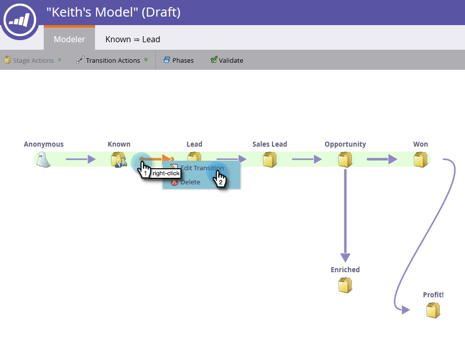
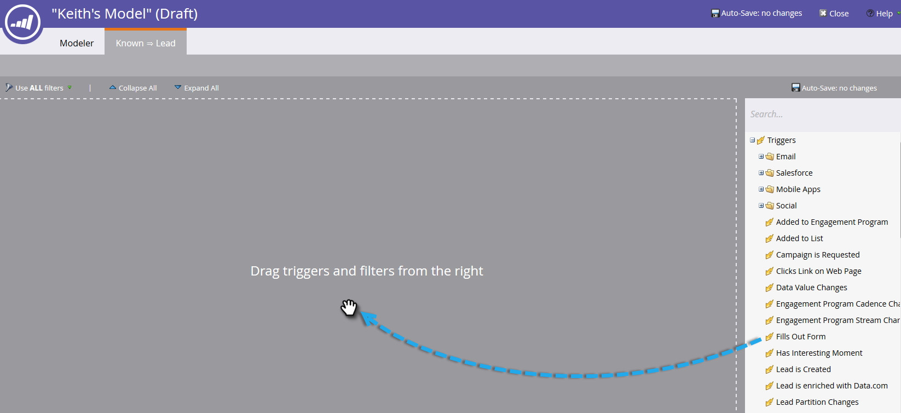

# Verwenden von Umsatzmodellübergängen {#using-revenue-model-transitions}

>[!PREREQUISITES]
>
>[Neues Umsatzmodell erstellen](/help/marketo/product-docs/reporting/revenue-cycle-analytics/revenue-cycle-models/create-a-new-revenue-model.md)

Wenn Sie Ihr Modell erstellen und Ihre Inventarphasen auswählen und organisieren, ist es an der Zeit, die Transitionen festzulegen.

1. Klicken Sie mit der rechten Maustaste (Sie können auch doppelklicken) auf einen der Pfeile, um zu beginnen, und wählen Sie **Transition bearbeiten**.

   

   >[!NOTE]
   >
   >Die Übergangsregeln &quot;Anonym für &quot;&quot;können nicht bearbeitet werden.

1. Für die ausgewählte Transition wird eine neue Registerkarte geöffnet.

   

1. Transitionen steuern, wie Leads zwischen Phasen wechseln. Ziehen Sie den gewünschten Trigger (oder Filter) von rechts und lassen Sie ihn an einer beliebigen Stelle auf der Arbeitsfläche frei. In diesem Beispiel wählen wir den Trigger Formular ausfüllen aus.

   >[!TIP]
   >
   >Da das Umsatzmodell Sie für die Berichterstellung einrichtet, wird empfohlen, dass die Transitionen immer Trigger enthalten. Auf diese Weise spiegeln Ihre Berichte die wahre Geschwindigkeit Ihres Modell-/Staging-Flusses wider. Für zusätzliche Einschränkungen können mit den Triggern Filter hinzugefügt werden.

   

1. Wählen Sie die Parameter für den ausgewählten Trigger/Filter aus.

   

1. Um zu Ihrem Modell zurückzukehren, klicken Sie auf **Modeler**.

   

1. Am unteren Bildschirmrand werden nun die Übergangsregeln angezeigt.

   

1. Nachdem Sie die Regeln für alle Ihre Transitionen konfiguriert haben, klicken Sie zur Überprüfung auf **Validieren** .

   

1. Wenn Sie die Funktion korrekt ausgeführt haben, wird die folgende Meldung angezeigt.

   

Gut gemacht! Sie haben Ihre Modellübergänge erfolgreich geändert.

>[!MORELIKETHIS]
>
>[Genehmigen/Aufheben der Genehmigung eines Umsatzmodells](/help/marketo/product-docs/reporting/revenue-cycle-analytics/revenue-cycle-models/approve-unapprove-a-revenue-model.md)
