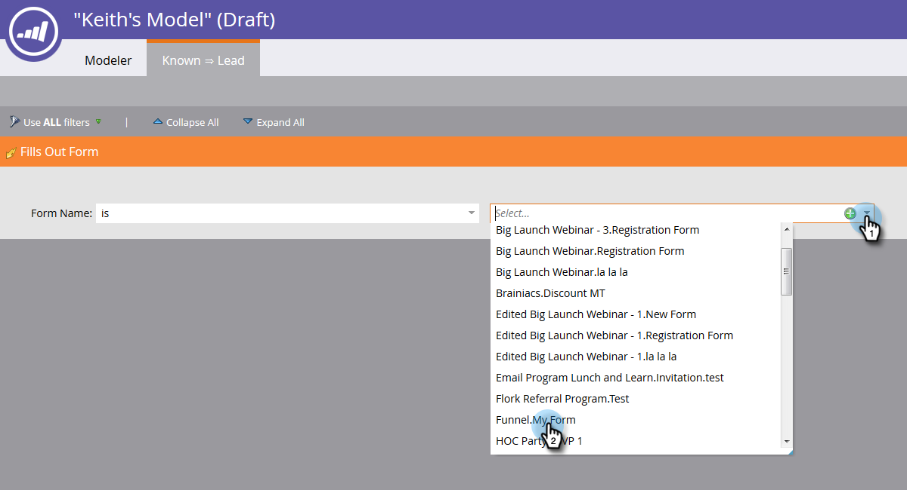
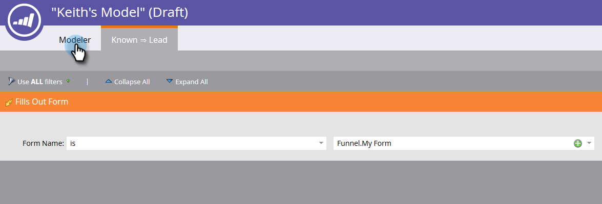
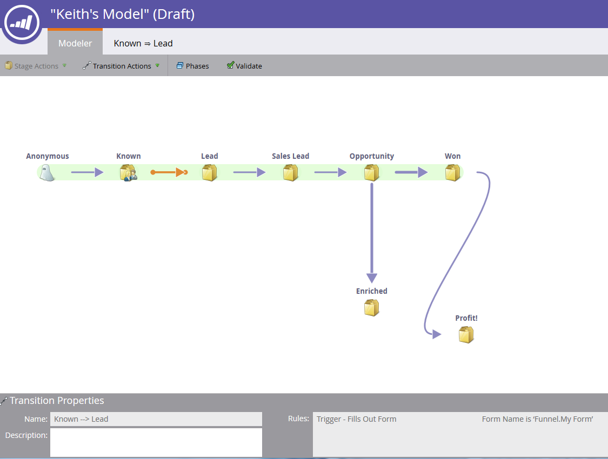
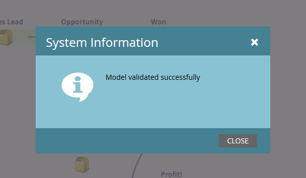

# Verwenden von Umsatzmodellübergängen {#using-revenue-model-transitions}

>[!PREREQUISITES]
>
>[Erstellen eines neuen Umsatzmodells](/help/marketo/product-docs/reporting/revenue-cycle-analytics/revenue-cycle-models/create-a-new-revenue-model.md)

Wenn Sie Ihr Modell erstellen und Ihre Inventarphasen auswählen und organisieren, ist es an der Zeit, die Übergänge festzulegen.

1. Klicken Sie mit der rechten Maustaste (Sie können auch doppelklicken) auf einen der Pfeile, um zu beginnen, und wählen Sie **[!UICONTROL Transition bearbeiten]**.

   

   >[!NOTE]
   >
   >Übergangsregeln [!UICONTROL Anonym] ⇒ [!UICONTROL Bekannter] können nicht bearbeitet werden.

1. Daraufhin wird eine neue Registerkarte für die ausgewählte Transition geöffnet.

   

1. Übergänge steuern, wie Leads zwischen den Stadien wechseln. Ziehen Sie den Trigger (oder Filter) Ihrer Wahl von rechts und lassen Sie ihn an einer beliebigen Stelle auf der Arbeitsfläche los. In diesem Beispiel wählen wir den Trigger **[!UICONTROL Formular ausfüllen]** aus.

   >[!TIP]
   >
   >Da der Umsatzmodellierer Sie für das Reporting einrichtet, wird empfohlen, dass die Transitionen immer Trigger enthalten. Auf diese Weise spiegeln Ihre Berichte die tatsächliche Geschwindigkeit Ihres Modell-/Staging-Flusses wider. Filter können mit den Triggern für zusätzliche Einschränkungen hinzugefügt werden.

   

1. Wählen Sie die Parameter für Ihren ausgewählten Trigger aus.

   

1. Um zu Ihrem Modell zurückzukehren, klicken Sie auf **[!UICONTROL Modeler]**.

   

1. Am unteren Bildschirmrand werden nun die Übergangsregeln angezeigt.

   

1. Nachdem Sie Regeln für alle Ihre Transitionen konfiguriert haben, klicken Sie auf **[!UICONTROL Validieren]** um sie zu überprüfen.

   

1. Wenn Sie dies richtig machen, wird die folgende Meldung angezeigt.

   

Gut gemacht! Sie haben Ihre Modellübergänge erfolgreich geändert.

>[!MORELIKETHIS]
>
>[Genehmigung eines Umsatzmodells erteilen/aufheben](/help/marketo/product-docs/reporting/revenue-cycle-analytics/revenue-cycle-models/approve-unapprove-a-revenue-model.md)
