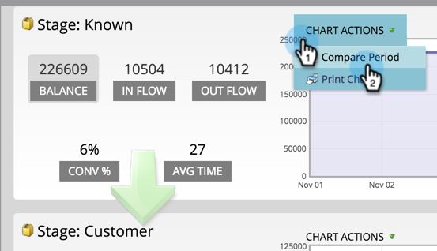
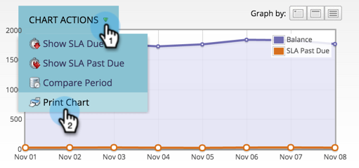

# Verwenden des Erfolgspfad-Analyzers {#using-the-success-path-analyzer}

Verwenden Sie einen Erfolgspfad-Analyzer, um die spezifischen Details zu untersuchen, die sowohl Fluss (Menge) als auch Geschwindigkeit (Geschwindigkeit, in Tagen) der Personen in den Phasen Ihrer [Modell für Umsatzzyklen](/help/marketo/product-docs/reporting/revenue-cycle-analytics/revenue-cycle-models/understanding-revenue-models.md).

>[!PREREQUISITES]
>
>[Erstellen eines Erfolgspfad-Analyzers](/help/marketo/product-docs/reporting/revenue-cycle-analytics/revenue-cycle-models/create-a-success-path-analyzer.md)

1. Navigieren Sie zu **Analytics** und wählen Sie **Erfolgspfad-Analyzer**.

   

   Das Diagramm auf der rechten Seite spiegelt die Daten der ausgewählten Schaltfläche auf der linken Seite wider. Standardmäßig ist dies Balance.

1. Klicks **In Fluss** , um zu bestimmen, wie viele Personen während des ausgewählten Zeitraums in die Bühne eingestiegen sind.

   

   * Klicken Sie auf Fluss verlassen , um zu zeichnen, wie viele Personen die Bühne verlassen haben.
   * Klicken Sie auf Konvertieren in % , um die Konversionsrate von dieser in die nächste Phase zu diagrammen.
   * Klicken Sie auf Durchschn. Zeit , um zu sehen, wie lange Personen in dieser Phase verbracht haben, bevor sie zur nächsten Phase übergehen.

1. Klicks **Diagrammaktionen** > Zeitraum vergleichen , um die Daten mit einem anderen Zeitrahmen gleicher Länge zu vergleichen.

   

1. Wählen Sie die **Von** Datum für den Vergleichszeitraum.

   

   Die **nach** Das Datum wird automatisch auf die Länge des ursprünglichen Zeitraums eingestellt.

1. Klicks **Vergleichen**.

   

1. Das Diagramm aktualisiert sich mit überlappenden Daten für den Vergleichszeitraum in Grün.

   

1. Um den Zeitrahmen des Diagramms zu ändern, klicken Sie auf einen der **Diagramm nach** Schaltflächen: täglich (Standard), wöchentlich und monatlich

   

1. Klicken Sie für Bühnen mit SLAs (Service-Level Agreements) auf **Diagrammaktionen** > **SLA-Fälligkeit anzeigen** um jede Person zu zeigen, die innerhalb des festgelegten Zeitraums ein SLA-Ziel verpasst hat.

   

1. Das Diagramm wird aktualisiert, um die Anzahl der SLAs für jeden Knoten in orangefarbenem Format widerzuspiegeln.

   

   Die orangefarbenen Leute könnten *oder nicht* noch in der SLA-Bühne.

1. Klicks **Diagrammaktionen** > **SLA-Vergangenheit anzeigen fällig** , um alle Personen mit abgelaufenen SLA-Zielen anzuzeigen, die sich am Ende des angegebenen Zeitraums noch in der SLA-Phase befinden.

   

1. Das Diagramm wird aktualisiert und gibt an, wie viele SLAs auf jedem Knoten überfällig waren (orange).

   

1. Um die spezifischen Details eines Datenpunkts auf einem bestimmten Knoten (Datum) zu lesen, bewegen Sie den Mauszeiger über den Punkt.

   

1. Klicken Sie zum Drucken des Diagramms auf **Diagrammaktionen** > **Druckdiagramm**.

   

Der Analyzer hilft Ihnen, Bewegungen durch Ihr Modell zu verstehen. Wenn Sie weitermachen, wird dies für die strategische Ausrichtung Ihrer Marketing-Maßnahmen sehr wichtig.
