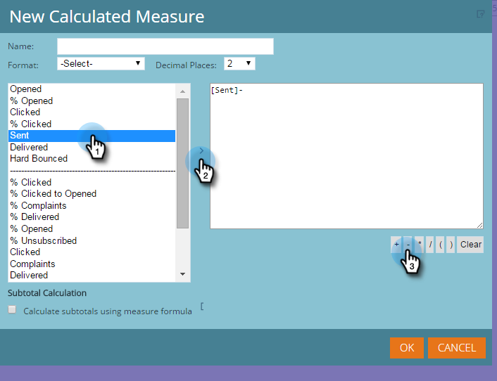

# Hinzufügen benutzerdefinierter Kennzahlen zu einem Umsatz-Explorer-Bericht {#adding-custom-measures-to-a-revenue-explorer-report}

Manchmal soll eine benutzerdefinierte Kennzahl in einem Bericht enthalten sein. Es ist einfach, eigene zu erstellen.

Im folgenden Beispiel erstellen Sie eine berechnete Kennzahl für Softbounces, bei der bereits im Bericht enthaltene Metriken verwendet werden und eine neue Metrik anhand einfacher Mathematik erstellt wird. Sie können auch andere Kennzahlentypen erstellen.

>[!PREREQUISITES]
>
>Sie benötigen mindestens eine Metrik in Ihrem Bericht, sie muss jedoch nicht zu den Kennzahlen gehören, die Sie zum Definieren Ihrer benutzerdefinierten Kennzahl verwenden.

1. Überziehen Sie die Felder, die Sie für Ihren Bericht benötigen. Weitere [ finden Sie unter „Hinzufügen von Feldern zu einem ](/help/marketo/product-docs/reporting/revenue-cycle-analytics/revenue-explorer/adding-fields-to-a-revenue-explorer-report.md)&quot;.

1. Klicken Sie mit der rechten Maustaste auf eine vorhandene Metrik (blaue Zelle), klicken Sie auf **[!UICONTROL Benutzerdefinierte Kennzahl]** und wählen Sie **[!UICONTROL Berechnete Kennzahl]**.

   

1. Benennen Sie Ihre benutzerdefinierte Kennzahl und wählen Sie ein Format aus.

   

1. Klicken Sie auf der linken Seite auf die einzelnen Elemente, die Sie benötigen, und klicken Sie auf den Pfeil, um sie zu verschieben. Fügen Sie bei Bedarf mathematische Symbole hinzu.

   

   >[!TIP]
   >
   >Sie können die mathematischen Symbole selbst eingeben oder das Auswahlfeld verwenden.

1. Wenn Sie fertig sind, klicken Sie auf **[!UICONTROL OK]**.

   

   Die neue benutzerdefinierte Kennzahl wird im Bericht als neue Spalte angezeigt.

   

   >[!MORELIKETHIS]
   >
   >[Hinzufügen von Feldern zu einem Umsatz-Explorer-Bericht](/help/marketo/product-docs/reporting/revenue-cycle-analytics/revenue-explorer/adding-fields-to-a-revenue-explorer-report.md)
