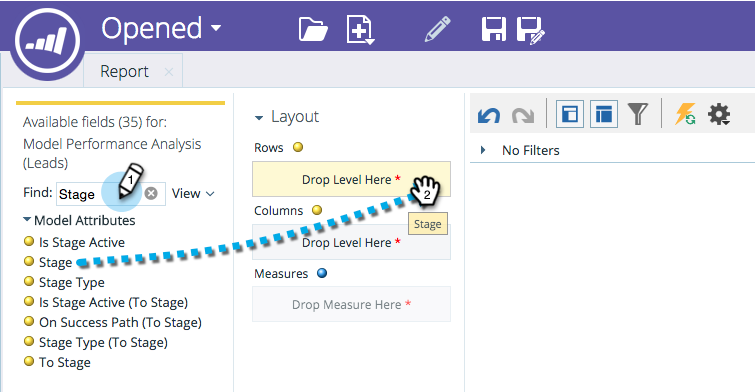

# Hinzufügen von Feldern zu einem Umsatz-Explorer-Bericht {#adding-fields-to-a-revenue-explorer-report}

Anpassen von Umsatz-Explorer-Berichten durch Ziehen und Ablegen von Dimensions- und Metrikfeldern in die Arbeitsfläche.

<table>
 <tbody>
  <tr>
   <th>Feldtyp</th>
   <th>Beschreibung</th>
  </tr>
  <tr>
   <td>Gelbes Feld für Dimension</td>
   <td>
Gelbe Felder sind die Dimensionen (Zeilen und Spalten) Ihres Berichts.

Sie können beispielsweise einen Bericht einrichten, der Ihren Lead-Status oder Ihr Erstellungsdatum in Spalten anzeigt.
</td>
  </tr>
  <tr>
   <td>Blaues Feld oder Maß</td>
   <td>
Blaue Felder sind Metriken, die in Ihren Daten analysiert werden.

Dies kann beispielsweise die durchschnittliche Lead-Bewertung für Ihre Leads oder die Anzahl der Tage sein, die ein Lead eine Opportunity hatte.
</td>
  </tr>
 </tbody>
</table>

1. Suchen Sie die gelben Felder, die Sie verwenden möchten, und ziehen Sie sie in die Zeilen.

   

   >[!TIP]
   >
   >Zeigen Sie mit der Maus auf ein Feld, um eine vollständige Beschreibung anzuzeigen.

1. Suchen Sie die blauen Felder, die Sie verwenden möchten, und ziehen Sie sie in Kennzahlen.

   

   Fantastisch! Jetzt habt ihr einen vollwertigen Bericht!

   

>[!MORELIKETHIS]
>
>[Löschen eines Felds in einem Umsatz-Explorer-Bericht](/help/marketo/product-docs/reporting/revenue-cycle-analytics/revenue-explorer/deleting-a-field-in-a-revenue-explorer-report.md)
