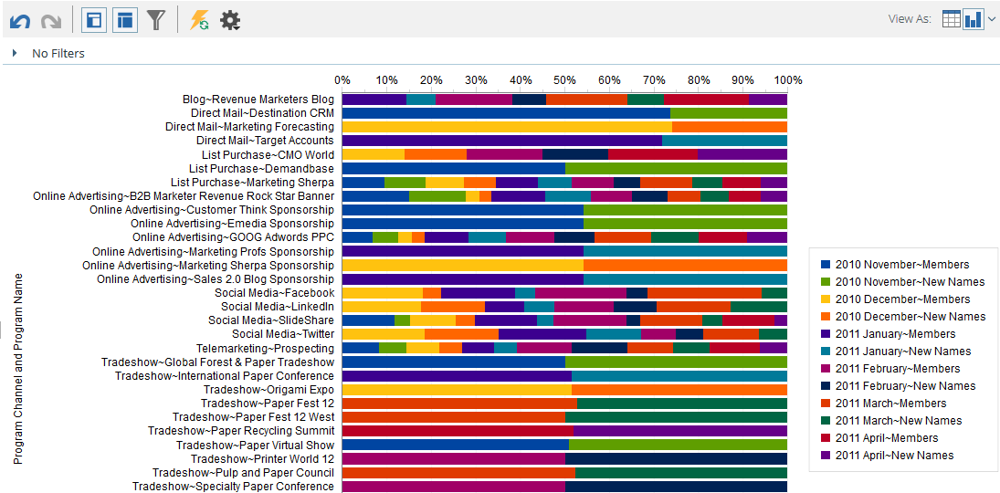
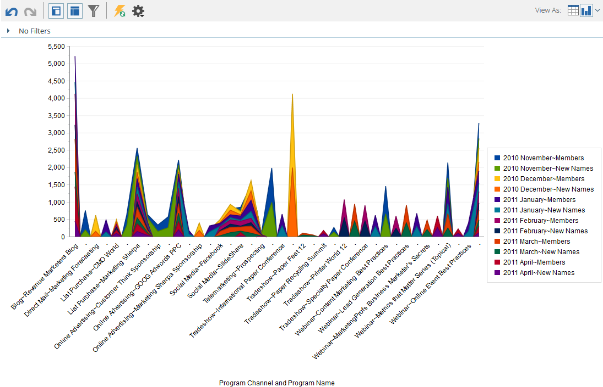

# Ergebnisse aus dem [!UICONTROL Umsatz-Explorer“ ] {#graphing-results-from-revenue-explorer}

Standardmäßig werden Berichte im [!UICONTROL Umsatz-Explorer] als Tabelle angezeigt. Sie haben auch die Möglichkeit, Ergebnisse als Diagramm in verschiedenen Formaten anzuzeigen.

1. Klicken Sie auf den Pfeil im **[!UICONTROL Anzeigen als]** Dropdown-Menü Ihres Berichts. Verschiedene Diagrammoptionen werden angezeigt.

   

## Beispiele für Diagramme {#graph-examples}

**[!UICONTROL Spalte]**: Jede Zeile und Spalte in der Tabelle wird als vertikale Spalte angezeigt.

**[!UICONTROL Gestapelte Spalte]**: Jede Zeile in der Tabelle enthält eine Spalte im Diagramm.

**[!UICONTROL 100 % gestapelte Spalte]**: Jede Zeile in der Tabelle enthält eine Spalte im Diagramm und wird auf 100 % skaliert.

**[!UICONTROL Linie]**: Jede Spalte wird als Linie und jede Zeile als Datenpunkt auf der Linie angezeigt.

**[!UICONTROL Spalten-Linien-]**: Kombination aus [!UICONTROL Spalten] und [!UICONTROL Linien] Diagrammen.

**[!UICONTROL Balken]**: Jede Zeile und Spalte in der Tabelle wird als horizontaler Balken angezeigt.

**[!UICONTROL Gestapelter Balken]**: Jede Zeile in der Tabelle enthält eine Zeile im Diagramm.

**[!UICONTROL 100 % gestapelter Balken]**: Jede Zeile in der Tabelle enthält eine Zeile im Diagramm und wird auf 100 % skaliert.

**[!UICONTROL Bereich]**: Die Daten werden ähnlich wie in der gestapelten Leiste angezeigt, aber ausgefüllt.

**[!UICONTROL Kreis]**: Jede Spalte wird als Kreisdiagramm angezeigt, jede Zeile als Bereich.

**[!UICONTROL Sunburst]**: Radiales Diagramm, das Attribute in Scheiben darstellt.

**[!UICONTROL Scatter]**: Blasen basierend auf verwendeten Attributen. Verwenden Sie Kennzahlen zur Farbcodierung der Blase und/oder zur Bestimmung ihrer Größe.

**[!UICONTROL Wärmenetz]**: Passen Sie Farben und Formen an, um positive und negative Leistungsmuster zu identifizieren.

1. Um zur Tabellenansicht zurückzukehren, klicken Sie auf die Schaltfläche Tabelle .

   
