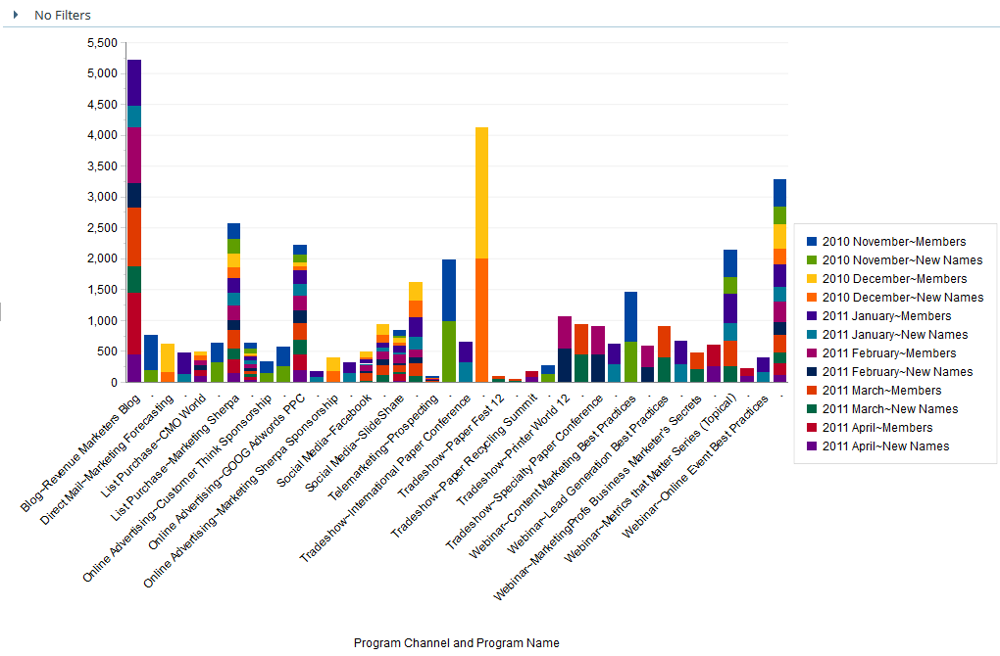
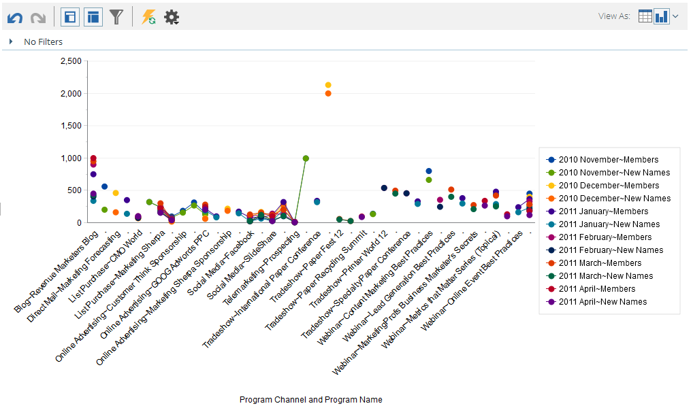

# Grafische Ergebnisse aus Umsatz-Explorer {#graphing-results-from-revenue-explorer}

Standardmäßig werden Berichte im Umsatz-Explorer als Tabelle angezeigt. Sie haben auch die Möglichkeit, die Ergebnisse als Diagramm in verschiedenen Formaten anzuzeigen.

1. Klicken Sie im Dropdown-Menü **Ansicht As** Ihres Berichts auf den Pfeil. Es werden verschiedene Diagrammoptionen angezeigt.

   

## Diagrammbeispiele {#graph-examples}

**Spalte**: Jede Zeile und Spalte in der Tabelle wird als vertikale Spalte angezeigt.

**Gestapelte Spalte**: Jede Zeile in der Tabelle enthält eine Spalte im Diagramm.

**100 % Gestapelte Spalte**: Jede Zeile in der Tabelle enthält eine Spalte im Diagramm und wird auf 100 % skaliert.

**Zeile**: Jede Spalte wird als Zeile und jede Zeile als Datenpunkt in der Zeile angezeigt.

**Spaltenzeilenkombo**: Kombination von Spalten- und Liniendiagrammen.

**Balken**: Jede Zeile und Spalte in der Tabelle wird als horizontale Leiste angezeigt.

**Gestapelter Balken**: Jede Zeile in der Tabelle enthält eine Zeile im Diagramm.

**100 % gestapelter Balken**: Jede Zeile in der Tabelle enthält eine Zeile im Diagramm und wird auf 100 % skaliert.

**Bereich**: Die Daten werden ähnlich wie die Gestapelte Leiste angezeigt, aber ausgefüllt.

**Kuchen**: Jede Spalte wird als Kreisdiagramm angezeigt, jede Zeile als Segment.

**Sunburst**: Radiales Diagramm, das Attribute in Scheiben darstellt.

**Streuung**: Blasen basierend auf den verwendeten Attributen. Verwenden Sie Maßnahmen, um die Blase farblich zu kodieren und/oder ihre Größe zu bestimmen.

**Kühlkörper**: Passen Sie Farben und Formen an, um positive und negative Leistungsmuster zu identifizieren.

1. Klicken Sie auf die Schaltfläche &quot;Tabelle&quot;, um zur Ansicht zurückzukehren.

   

