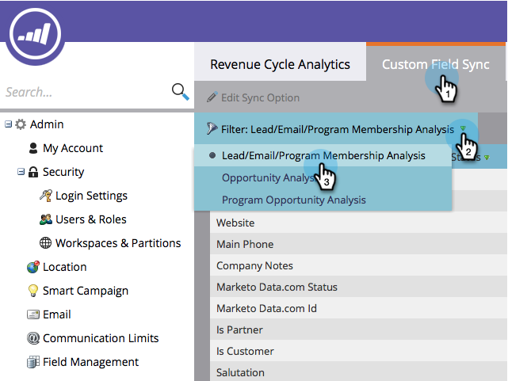
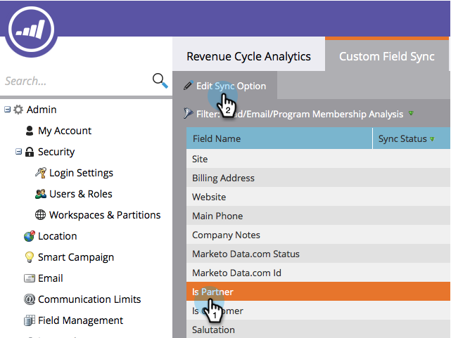
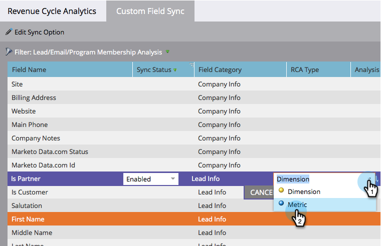

# Benutzerdefinierte Felder mit dem [!UICONTROL Umsatz-Explorer“ ] {#sync-custom-fields-to-the-revenue-explorer}

[!UICONTROL Umsatzzyklusanalyse] kann Berichte zu benutzerdefinierten Marketo-Feldern erstellen. Dazu müssen Sie die benutzerdefinierten Felder festlegen, die synchronisiert werden sollen.

>[!NOTE]
>
>**Admin-Berechtigungen erforderlich**

1. Navigieren Sie zum Abschnitt **[!UICONTROL Admin]**.

   

1. Wählen Sie **[!UICONTROL Umsatzzyklusanalyse]** aus.

   

1. Klicken Sie auf die **[!UICONTROL Synchronisierung benutzerdefinierter Felder]** und wählen Sie den gewünschten Analysebereich aus.

   

1. Wählen Sie das Feld aus, für das Sie die Synchronisierung aktivieren möchten, und klicken Sie auf **[!UICONTROL Synchronisierungsoption bearbeiten]**.

   

1. Ändern Sie **[!UICONTROL Synchronisierungsstatus]** in **[!UICONTROL Aktiviert]**.

   

1. Wählen Sie **[!UICONTROL gewünschten RCA]** Typ aus und klicken Sie dann auf **[!UICONTROL Speichern]**.

   

   >[!TIP]
   >
   >Nach der Aktivierung sind die Daten am [!UICONTROL  Tag in ]Umsatzzyklusanalyse“ verfügbar.

   Gute Arbeit! Jetzt wissen Sie, wie Sie benutzerdefinierte Felder zu RCA hinzufügen.
