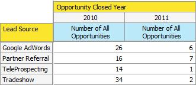

# Verstehen der Opportunity-Analyse im Umsatz-Explorer {#understanding-opportunity-analysis-in-revenue-explorer}

Mit der Opportunity-Analyse im Umsatz-Explorer können Sie Ihre Opportunities eingehender untersuchen. Schneiden Sie die Daten basierend auf beliebigen Lead-/Unternehmensattributen wie Lead-Quelle, Branche oder Geografie aus. Analyse der Opportunity-Erstellung und des Opportunity-Abschlusses basierend auf Name, Stadium oder Wahrscheinlichkeit. Erfahren Sie mehr über Marketing-Beiträge zur Pipeline.

## Beispielanalyse {#example-analysis}

Im Folgenden finden Sie einige Berichte, die Sie im Bereich Opportunity-Analyse erstellen können.

1. Marketing-Einfluss auf erstellte Opportunitys

   Welcher Prozentsatz der Pipeline Ihres Unternehmens wurde durch Ihre Marketing-Programme beeinflusst? Dieser Bericht gibt Ihnen die Antwort. Die folgenden Tortendiagramme zeigen den Prozentsatz der Anzahl aller Opportunitys und den Opportunity-Betrag, die von einem Marketing-Programm erworben wurden.

   

1. Marketing-Einfluss auf abgeschlossene und gewonnene Vertriebschancen.

   Dieser Bericht zeigt nach Anzahl und Betrag, wie viel Umsatz durch Marketing erzielt und beeinflusst wurde.

   

1. Opportunity von Lead Source geschlossen

   Dieser Bericht enthält alle von der Lead-Quelle geschlossenen Opportunitys und gibt Ihnen einen klaren Überblick darüber, welche Quellen funktionieren und welche nicht.

   

1. Zeit bis Schließen nach Source

   Dieser Bericht zeigt die Beziehung zwischen den durchschnittlichen Tagen bis zum Abschluss einer Opportunity und der Lead-Quelle.

   

1. Opportunity und Staging öffnen

   Dieser Bericht zeigt, wie viele Opportunitys in jeder Umsatzzyklusphase offen sind.

   

1. Anzahl der Vertriebschancen nach Jahr und Branche

   Dieser Bericht beantwortet die Frage: „Erhalten wir von Jahr zu Jahr mehr oder weniger Chancen aus bestimmten Branchen?“

   

## Dimensionen und Maßnahmen zur Opportunity-Analyse {#opportunity-analysis-dimensions-and-measures}

Die Opportunity-Analyse bietet Ihnen Zugriff auf alle Lead-, Unternehmens- und Opportunity-bezogenen Dimensionen und Opportunity-bezogenen Messgrößen. Verwenden Sie diese Opportunity Analysis-Dimensionen und -Kennzahlen, um spezifische Fragen in Ihrem Bericht zu beantworten.

1. Unternehmensattribute

   | Dimension | Beschreibung |
   |---|---|
   | Jahresumsatz | Jahresumsatz des Unternehmens |
   | Stadt | Die Stadt, in der sich das Unternehmen befindet |
   | Land | Das Land, in dem das Unternehmen seinen Sitz hat |
   | Branche | Die Branche, in der sich das Unternehmen befindet |
   | Firmenname | Name des Unternehmens |
   | Anzahl der Mitarbeiter | Anzahl der Mitarbeiter im Unternehmen |
   | Postleitzahl | Postleitzahl des Unternehmens |
   | SIC-Code | SIC-Code des Unternehmens |
   | Land | Das Bundesland, in dem das Unternehmen seinen Sitz hat |

1. Lead-Attribute

   | Dimension | Beschreibung |
   |---|---|
   | Auf der Sperrliste | Der Lead ist auf die Blockierungsliste gesetzt |
   | In Opportunity konvertiert | Der Lead wird in eine Opportunity umgewandelt |
   | E-Mail-Adresse ungültig | Ob der Lead eine gültige E-Mail-Adresse hat |
   | Marketing eingestellt | Ist der Lead von Marketing-E-Mails suspendiert |
   | E-Mail-Adresse | E-Mail-Adresse des Leads |
   | Jobtitel | Stellenbezeichnung des Leads |
   | Vollständiger Name | Vollständiger Name des Leads |
   | Ursprünglicher Quellentyp | Quelltyp des Leads |
   | Source-Typ registrieren | Registrierter Quelltyp des Leads |
   | E-Mail-Adresse des Lead-Eigentümers | E-Mail-Adresse des Lead-Inhabers |
   | Position des Lead-Eigentümers | Stellenbezeichnung des Lead-Inhabers |
   | Name des Lead-Inhabers | Name des Lead-Besitzers |
   | Lead-Quelle | Lead-Quelle |
   | Lead-Status | Lead-Status |

1. Zeitraum für Lead-Erstellung

   | Dimension | Beschreibung |
   |---|---|
   | Lead hat Jahr erstellt | Das Jahr, in dem der Lead erstellt wurde |
   | Lead hat Quartal erstellt | Das Quartal, in dem der Lead erstellt wurde |
   | Lead hat Monat erstellt | Der Monat, in dem der Lead erstellt wurde |
   | Lead hat Woche erstellt | Die Woche, in der der Lead erstellt wurde |
   | Lead Erstellungsdatum | Das Datum, an dem der Lead erstellt wurde |

1. Opportunity-Attribute

   | Dimension | Beschreibung |
   |---|---|
   | Opportunity geschlossen | Ist die Opportunity geschlossen |
   | Opportunity-Prognosekategorie | Prognosekategorie der Opportunity |
   | Opportunity-Name | Opportunity-Name |
   | Opportunity-Stadium | Opportunity-Phase |
   | Opportunity-Typ | Opportunity-Typ |
   | Opportunity – Gewonnen | Ist diese Opportunity geschlossen und gewonnen? |
   | Marketing-beeinflusste Opportunity | Diese Markierung gibt an, ob einer der Leads/Kontakte durch ein Marketing-Programm erworben oder erfolgreich abgeschlossen wurde. Nur Programme mit einem definierten Kostenzeitraum werden berücksichtigt. |

1. Geschlossener Zeitrahmen der Opportunity

   | Dimension | Beschreibung |
   |---|---|
   | Opportunity Abschlussjahr | Das Jahr, in dem die Opportunity geschlossen wird |
   | Opportunity-Abschlussquartal | Das Quartal, in dem die Opportunity geschlossen wird |
   | Opportunity-Abschluss Monat | Der Monat, in dem die Opportunity geschlossen wird |
   | Opportunity geschlossen Woche | Die Woche, in der die Opportunity geschlossen wird |
   | Opportunity Abschlussdatum | Das Datum, an dem die Opportunity geschlossen wird |

1. Opportunity hat Zeitrahmen erstellt

   | Dimension | Beschreibung |
   |---|---|
   | Opportunity hat Jahr erstellt | Das Jahr, in dem die Opportunity erstellt wird |
   | Opportunity hat Quartal erstellt | Das Quartal, in dem die Opportunity erstellt wurde |
   | Opportunity hat Monat erstellt | Der Monat, in dem die Opportunity erstellt wurde |
   | Opportunity hat Woche erstellt | Die Woche, in der die Opportunity erstellt wurde |
   | Opportunity-Erstellungsdatum | Das Datum, an dem die Opportunity erstellt wurde |

1. Kennzahlen

   | Maßnahme | Beschreibung |
   |---|---|
   | Durchschn. Tage bis zum Abschluss der Opportunity | Durchschnittliche Anzahl der Tage bis zum Schließen einer Opportunity |
   | Durchschn. Tage bis zum Abschluss der Opportunity (verloren) | Durchschnittliche Anzahl der Tage bis zu einer verlorenen Opportunity |
   | Durchschn. Tage bis zum Abschluss der Opportunity (gewonnen) | Durchschnittliche Anzahl der Tage bis zu einer gewonnenen Opportunity |
   | Anzahl aller Gelegenheiten | Gesamtzahl aller Gelegenheiten |
   | Anzahl der Vertriebschancen (geschlossen) | Gesamtzahl der abgeschlossenen Vertriebschancen (gewonnen oder verloren) |
   | Anzahl der Vertriebschancen (verloren) | Gesamtzahl der verlorenen Opportunitys |
   | Anzahl der Vertriebschancen (offen) | Gesamtzahl der noch offenen Opportunitys |
   | Anzahl an Vertriebschancen (gewonnen) | Gesamtzahl der gewonnenen Opportunitys |
   | Opportunity-Betrag | Opportunity-Gesamtbetrag Wenn einer Opportunity mehr als ein Lead zugeordnet ist, basiert die Zuteilung auf der Lead-Bewertung. |
   | Opportunity-Betrag (verloren) | Gesamtbetrag für verlorene Opportunitys. Wenn einer Opportunity mehr als ein Lead zugeordnet ist, basiert die Zuteilung auf der Lead-Bewertung. |
   | Opportunity-Betrag (offen) | Gesamtbetrag der offenen Vertriebschancen. Wenn einer Opportunity mehr als ein Lead zugeordnet ist, basiert die Zuteilung auf der Lead-Bewertung. |
   | Opportunity-Betrag (gewonnen) | Gesamtbetrag der gewonnenen Vertriebschancen. Wenn einer Opportunity mehr als ein Lead zugeordnet ist, basiert die Zuteilung auf der Lead-Bewertung. |

>[!MORELIKETHIS]
>
>* [Erstellen eines Revenue Explorer-Berichts](/help/marketo/product-docs/reporting/revenue-cycle-analytics/revenue-explorer/create-a-revenue-explorer-report.md)
>* [Hinzufügen von Feldern zu einem Umsatz-Explorer-Bericht](/help/marketo/product-docs/reporting/revenue-cycle-analytics/revenue-explorer/adding-fields-to-a-revenue-explorer-report.md)
>* [Abonnieren eines Revenue Explorer-Berichts](/help/marketo/product-docs/reporting/revenue-cycle-analytics/revenue-explorer/subscribe-to-a-revenue-explorer-report.md)
