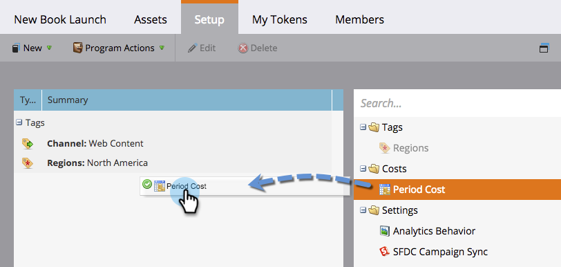

# Definieren der Kostenzeiträume {#define-period-costs}

>[!NOTE]
>
>**Definition**
>
>Ein Kostenzeitraum ist der Betrag, den Sie für ein Programm ausgeben. Sie kann ein oder mehrere Monate dauern und wird für die ROI-Berichterstellung verwendet.

Verfolgen und verknüpfen Sie Lead-Pflege- und Lead-Akquise-Kosten für ein Programm oder Ereignis, indem Sie definieren, wann und wo Sie Lead-Kosten übernehmen möchten.

>[!NOTE]
>
>Geben Sie zu Beginn eines Programms die prognostizierten Kosten ein. Sobald die Periode im Programm abgeschlossen ist, können Sie die [!UICONTROL Periodenkosten] bearbeiten und die Ist-Kosten eingeben. Dadurch erhalten Sie genaue Berichtsergebnisse.

## Definieren Sie [!UICONTROL Periodenkosten] {#define-a-period-cost}

1. Rufen Sie **[!UICONTROL Registerkarte]** Setup“ Ihres Programms oder Ereignisses auf.

   

1. Ziehen Sie &quot;**[!UICONTROL Kosten“ per Drag-and]** Drop auf die Arbeitsfläche. Das Dialogfeld **[!UICONTROL Neue Kosten]** wird angezeigt.

   

1. Geben Sie den **[!UICONTROL Programmmonat]** ein, den Sie mit den definierten Kosten verknüpfen möchten.

   

1. Geben Sie **[!UICONTROL Periodenkosten]** als Ganzzahl ohne Dezimalstellen oder Kommas ein (Höchstgrenze: 99999999)

   

   >[!NOTE]
   >
   >Die Währung (z. B. USD, EUR usw.) ist eine globale Einstellung, die von einem Marketo-Administrator verwaltet wird

1. Geben Sie einen beschreibenden **[!UICONTROL Hinweis]** (optional) ein und klicken Sie auf **[!UICONTROL Speichern]**.

   

## [!UICONTROL  bearbeiten (Periodenkosten] {#edit-a-period-cost}

1. Klicken Sie mit der rechten Maustaste auf [!UICONTROL Periodenkosten] und wählen Sie **[!UICONTROL Bearbeiten]** aus dem Popup-Menü aus, um das Dialogfeld **[!UICONTROL Kosten bearbeiten]** zu öffnen.

   

1. Periodenkosten nach Bedarf bearbeiten

   

## Löschen eines [!UICONTROL Kostenzeitraums] {#delete-a-period-cost}

1. Klicken Sie mit der rechten Maustaste auf [!UICONTROL Periodenkosten] den Sie löschen möchten, und wählen Sie **[!UICONTROL Löschen]** aus dem Popup-Menü aus, um die Eingabeaufforderung **[!UICONTROL Kosten löschen]** anzuzeigen.

   

1. Klicken Sie auf **[!UICONTROL Löschen]**, um den Kostenzeitraum dauerhaft zu löschen, oder auf **[!UICONTROL Abbrechen]**, um zurückzugehen.

   
