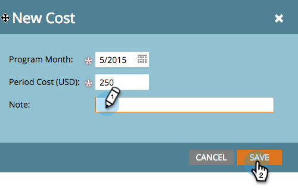
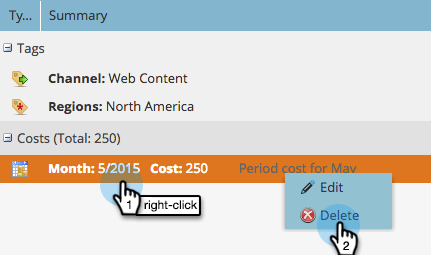

# Definieren von Zeitkosten {#define-period-costs}

>[!NOTE]
>
>**Definition**
>
>Ein Zeitraumpreis ist der Betrag, den Sie für ein Programm ausgeben. Es kann ein oder mehrere Monate dauern und wird für den Berichte-ROI verwendet.

Verfolgen und verbinden Sie die Kosten für Lead-Pflege und Interessentenakquise für ein Programm oder Ereignis, indem Sie festlegen, wann und wo Sie Kosten für Leads übernehmen möchten.

>[!NOTE]
>
>Geben Sie zu Beginn eines Programms die prognostizierten Kosten ein. Nach Abschluss des Programms können Sie die Zeitraumkosten bearbeiten und die tatsächlichen Kosten eingeben. Dadurch erhalten Sie genaue Berichte.

## Definieren von Zeitkosten {#define-a-period-cost}

1. Rufen Sie die Registerkarte **Setup** Ihres Programms oder Ereignisses auf.

   

1. Ziehen Sie **Period Cost** per Drag &amp; Drop auf die Arbeitsfläche und das Dialogfeld **Neue Kosten** wird angezeigt.

   

1. Geben Sie den **Programm-Monat** ein, den Sie mit den definierten Kosten verbinden möchten.

   

1. Geben Sie eine **Periodenkosten** als Ganzzahl ohne Dezimalstellen oder Kommas ein (max. 99999999)

   

   >[!NOTE]
   >
   >Die Währung (z. B. USD, EUR usw.) ist eine globale Einstellung, die von einem Marketing-Administrator verwaltet wird.

1. Geben Sie einen beschreibenden **Hinweis** ein (optional) und klicken Sie auf **Speichern**.

   

## Bearbeiten von Zeitkosten {#edit-a-period-cost}

1. Klicken Sie mit der rechten Maustaste auf die Kosten des Zeitraums und wählen Sie **Bearbeiten **aus dem Popup-Menü, um das Dialogfeld Kosten **bearbeiten** zu öffnen.

   

1. Bearbeiten Sie die Zeitkosten nach Bedarf.

   

## Löschen von Zeitkosten {#delete-a-period-cost}

1. Klicken Sie mit der rechten Maustaste auf den zu löschenden Zeitraum und wählen Sie **Löschen **aus dem Popup-Menü, um die Eingabeaufforderung **Kosten löschen **anzuzeigen.

   

1. Klicken Sie auf **Löschen** , um die Zeitkosten dauerhaft zu löschen, oder auf **Abbrechen** , um zurückzukehren.

   

