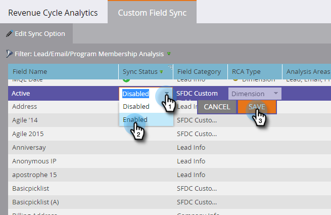

# Aktivieren der Synchronisierung benutzerdefinierter Felder für [!UICONTROL Umsatzzyklusanalyse] {#enabling-custom-field-sync-for-revenue-cycle-analytics}

Mit den folgenden Schritten können Sie benutzerdefinierte Felder in RCA-Berichten verwenden.

1. Klicken Sie auf **[!UICONTROL Admin]**.

   

1. Klicken Sie auf **[!UICONTROL Umsatzzyklusanalyse]** und dann auf **[!UICONTROL Benutzerdefinierte Feldsynchronisierung]**.

   

1. Wählen Sie **[!UICONTROL Feldname]** aus und klicken Sie dann auf **[!UICONTROL Synchronisierungsoption bearbeiten]**.

   

1. Wählen **[!UICONTROL unter &quot;]**&quot; die Option **[!UICONTROL Aktiviert]** und klicken Sie dann auf **[!UICONTROL Speichern]**.

   

1. Bei der grünen Prüfung wird angezeigt, dass das Feld für die Synchronisierung eingerichtet wurde.

   

   Und das war&#39;s!

   >[!NOTE]
   >
   >Nachdem das Feld aktiviert wurde, sind die Daten am nächsten Tag in [!UICONTROL Umsatzzyklusanalyse] verfügbar.
