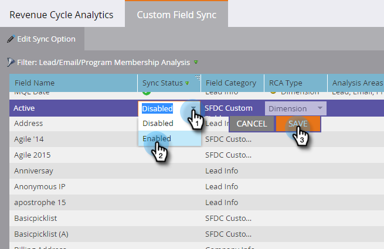

# Aktivieren der Synchronisierung benutzerdefinierter Felder für die Umsatzzyklusanalyse {#enabling-custom-field-sync-for-revenue-cycle-analytics}

Mit den folgenden Schritten können Sie benutzerdefinierte Felder in RCA-Berichten verwenden.

1. Klicken Sie auf **Admin**.

   

1. Klicken Sie auf **Umsatzzyklusanalyse** und dann auf **Benutzerdefinierte Feldsynchronisierung**.

   

1. Wählen Sie **Feldname** aus und klicken Sie dann auf **Synchronisierungsoption bearbeiten**.

   

1. Wählen Sie unter Synchronisierungsstatus **Aktiviert** und klicken Sie dann auf **Speichern**.

   

1. Bei der grünen Prüfung wird angezeigt, dass das Feld für die Synchronisierung eingerichtet wurde.

   

   Und das war&#39;s!

   >[!NOTE]
   >
   >Nachdem das Feld aktiviert wurde, sind die Daten am nächsten Tag in der Umsatzzyklusanalyse verfügbar.
