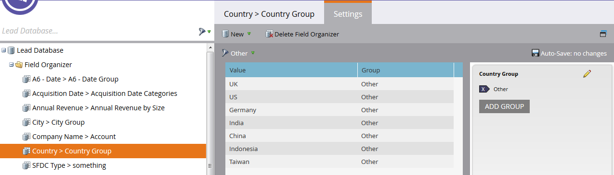

# Erstellen benutzerdefinierter Feldergruppen mit dem Feld-Organizer {#create-custom-field-groups-using-the-field-organizer}

Bevor Sie benutzerdefinierte Feldergruppen für das Reporting im Bereich Modellleistungsanalyse (Leads) des Umsatzzyklus-Explorers aktivieren können, müssen Sie standardmäßige oder benutzerdefinierte Felder in Gruppen für das Reporting über den Feld-Organisator in der Marketo-Lead-Verwaltung kategorisieren. Dies gilt nur für Lead- und Firmenattribute.
Wenn Sie ein Standardfeld oder ein benutzerdefiniertes Feld aus der Dropdown-Liste Feld im Dialogfeld „Neuer Feltorganisator“ auswählen, ordnet das System den Datentyp Marketo-Lead-Management dem Feld zu, das Sie gruppieren möchten, und zwar mit einem der drei verfügbaren Editoren im Feld-Organizer: Zeichenfolge, Ganzzahl oder Datum.

| Marketo-Lead-Management-Datentyp | Datentyp des Feltorganisator-Editors |
|---|---|
| Zeichenfolge | Zeichenfolge |
| E-Mail | Zeichenfolge |
| Ganzzahl | Ganzzahl |
| Text | String |
| URL | String |
| Referenz | Nicht unterstützt |
| Währung | Ganzzahl |
| Datum/Uhrzeit | Datum |
| Boolesch | Nicht unterstützt |
| Telefon | String |
| Datum | Datum |
| Gleitkomma | Ganzzahl |
| Berechnet | Nicht unterstützt |

In den nächsten drei Abschnitten wird beschrieben, wie Sie eine benutzerdefinierte Feldergruppe für eine Zeichenfolge, eine Ganzzahl oder einen Datumstyp erstellen.

## Erstellen einer benutzerdefinierten Feldergruppe - Zeichenfolgen-Editor {#create-custom-field-group-string-editor}

1. Klicken Sie **[!UICONTROL Lead-Datenbank]**.

   

1. Klicken Sie auf **[!UICONTROL Neu]** und wählen Sie **[!UICONTROL Neuer Feld-Organisator]**.

   

1. Klicken Sie **[!UICONTROL Feld]** und wählen Sie ein standardmäßiges oder benutzerdefiniertes Feld mit einem Datentyp aus, der dem Zeichenfolgen-Editor zugeordnet ist (siehe Tabelle im vorherigen Abschnitt). [!UICONTROL Land] wird hier verwendet.

   

1. Klicken Sie auf **[!UICONTROL Erstellen]**.

   

   Die neue benutzerdefinierte Gruppe wird in der Struktur der Lead-Datenbank angezeigt, die als Feldname > Feldnamengruppe dargestellt wird (Beispiel: Land > Ländergruppe).

   

1. Klicken Sie auf das Stiftsymbol, um den Namen anzupassen. Sie können beispielsweise „Ländergruppe“ in „Kontinent“ umbenennen. Geben Sie den gewünschten neuen Namen ein und klicken Sie auf eine andere Stelle, um das Feld automatisch zu speichern.

   

1. Standardmäßig werden alle Datenwerte in der Untergruppe [!UICONTROL Sonstige] platziert. Um die Datenwerte zu kategorisieren, klicken Sie auf **[!UICONTROL Gruppe hinzufügen]**, um eine Untergruppe zu erstellen und ihr einen Namen zu geben.

   >[!NOTE]
   >
   >Sie können bis zu zehn Untergruppen hinzufügen, um die Datenwerte zu kategorisieren. Jeder erstellten Untergruppe wird eine ID-Nummer zugewiesen.

   In diesem Beispiel wurden für die meisten Kontinente Gruppen erstellt.

   

   >[!NOTE]
   >
   >Um eine Untergruppe zu löschen, klicken Sie einfach auf das rote X neben dem Namen der Untergruppe. Wenn sich Datenwerte in der Gruppe befinden, werden die Datenwerte in die Standardgruppe &quot;[!UICONTROL &quot; ].

1. Markieren Sie einen oder mehrere Datenwerte auf der Arbeitsfläche und ziehen Sie sie per Drag-and-Drop in die entsprechende Untergruppe.

   

   >[!NOTE]
   >
   >Um einen Datenwert aus einer Untergruppe zu entfernen, weisen Sie den Datenwert der Standardgruppe „Sonstige“ neu zu.

1. Verwenden Sie die Filteroption in der oberen linken Ecke direkt über der Arbeitsfläche, um die Datenwerte in einer oder mehreren Untergruppen auszuwählen und anzuzeigen. Die Datenwerte, die auf Ihrer Filterauswahl basieren, werden auf der Arbeitsfläche angezeigt.

   

   >[!NOTE]
   >
   >Nachdem die Gruppen definiert wurden, können Sie die benutzerdefinierte Feldergruppe für das Reporting in der Modellleistungsanalyse (Leads) über die Registerkarte Umsatzzyklusanalyse in Marketo-Lead-Management aktivieren.

## Erstellen einer benutzerdefinierten Feldergruppe - Ganzzahl-Editor {#create-custom-field-group-integer-editor}

1. Klicken Sie **[!UICONTROL Lead-Datenbank]**.

   

1. Klicken Sie auf **[!UICONTROL Neu]** und wählen Sie **[!UICONTROL Neuer Feld-Organisator]**.

   

1. Klicken Sie **[!UICONTROL Feld]** und wählen Sie ein standardmäßiges oder benutzerdefiniertes Feld mit einem Datentyp aus, der dem Zeichenfolgen-Editor zugeordnet ist (siehe Tabelle im vorherigen Abschnitt). [!UICONTROL Jahresumsatz] wird hier verwendet.

   

1. Klicken Sie auf **[!UICONTROL Erstellen]**.

   

   Die neue benutzerdefinierte Gruppe wird in der Struktur der Lead-Datenbank angezeigt, die als Feldname > Feldnamengruppe dargestellt wird (Beispiel: Jahresumsatz > Jährliche Umsatzgruppe).

   

1. Klicken Sie auf den Namen der benutzerdefinierten Standardgruppe über dem Ganzzahleditor, um den Namen anzupassen. Sie können beispielsweise „Gruppe Jahresumsatz“ in „Jahresumsatz nach Größe“ umbenennen. Klicken Sie auf **[!UICONTROL Speichern]**.

   

   Mit dem Ganzzahl-Editor können Sie mehrere Untergruppen erstellen, um jede Untergruppe nach Größe zu definieren. In diesem Beispiel werden drei Gruppen für kleine, Medium- und Enterprise-Unternehmen erstellt.

1. Um Ihre erste Gruppe hinzuzufügen, geben Sie einen Namen in das Feld **[!UICONTROL Gruppenname]** ein (Beispiel: Klein) und geben Sie einen Maximalwert in das Feld **[!UICONTROL Gruppenname]** ein (Beispiel: 200000). Klicken Sie **[!UICONTROL Gruppe hinzufügen]**.

   

   Unter der gerade eingegebenen Gruppe wird ein leerer Gruppeneintrag angezeigt. Das folgende Beispiel zeigt einen Eintrag für kleine, Medium- und Enterprise-Unternehmen.

   >[!NOTE]
   >
   >Sie können bis zu zehn Untergruppen hinzufügen, um die Datenwerte zu kategorisieren. Jeder Gruppenbereichseintrag baut auf dem vorherigen Eintrag auf. Wenn Sie für die letzte von Ihnen erstellte benutzerdefinierte Untergruppe den letzten Gruppenbereichseintrag leer lassen, wird kein maximaler Datenwert festgelegt.

1. Klicken Sie auf die Registerkarte Zusammenfassung , um Ihre Einstellungen zu speichern und zu überprüfen.

   

   >[!NOTE]
   >
   >Um eine Untergruppe zu löschen, klicken Sie auf das rote X neben dem Namen der Untergruppe.

1. Überprüfen Sie Ihre Einstellungen auf der Seite Zusammenfassung .

   

   >[!NOTE]
   >
   >Nachdem die Gruppen definiert wurden, können Sie die benutzerdefinierte Feldergruppe für das Reporting in der Modellleistungsanalyse (Leads) über die Registerkarte Umsatzzyklusanalyse in Marketo-Lead-Management aktivieren.

## Erstellen einer benutzerdefinierten Feldergruppe - Datums-Editor {#create-custom-field-group-date-editor}

1. Klicken Sie **[!UICONTROL Lead-Datenbank]**.

   

1. Klicken Sie auf **[!UICONTROL Neu]** und wählen Sie **[!UICONTROL Neuer Feld-Organisator]**.

   

1. Klicken Sie **[!UICONTROL Feld]** und wählen Sie ein standardmäßiges oder benutzerdefiniertes Feld mit einem Datentyp aus, der dem Zeichenfolgen-Editor zugeordnet ist (siehe Tabelle im vorherigen Abschnitt). [!UICONTROL Akquisitionsdatum] wird hier verwendet.

   

1. Klicken Sie auf **[!UICONTROL Erstellen]**.

   

   Die neue benutzerdefinierte Gruppe wird in der Struktur der Lead-Datenbank angezeigt, die als Feldname > Feldnamengruppe dargestellt wird (Beispiel: Akquise-Datum > Akquise-Datumsgruppe).

   

1. Klicken Sie auf den Namen der benutzerdefinierten Standardgruppe über dem Datumseditor, um den Namen anzupassen. Sie können beispielsweise „Akquisitionsdatumsgruppe“ in „Akquisitionsdatumskategorien“ umbenennen. Klicken Sie auf **[!UICONTROL Speichern]**.

   

   Mit dem Datumseditor können Sie mehrere Untergruppen erstellen und jede Untergruppe nach Datum definieren. In diesem Beispiel werden drei Gruppen erstellt: Q1-15 Leads, Q2-15 Leads und Q3-15 Leads.

1. Um Ihre erste Gruppe hinzuzufügen, geben Sie einen Namen in das Feld **[!UICONTROL Gruppenname]** ein (Beispiel: Q1-15 Leads) und geben Sie ein Datum in das Feld Datum ein, das dem Datum entspricht, an dem der Lead am oder vor erworben wurde (Beispiel: 3/31/2015 für den letzten Tag von Q1-15). Klicken Sie **[!UICONTROL Gruppe hinzufügen]**.

   

   >[!NOTE]
   >
   >Sie können bis zu zehn Untergruppen hinzufügen, um die Datenwerte zu kategorisieren. Jeder [!UICONTROL Gruppenbereich] baut auf dem vorherigen Eintrag auf. Wenn Sie für die letzte [!UICONTROL  erstellte Untergruppe den ] „Gruppenbereich“ leer lassen, wird kein Enddatumswert festgelegt.

   Das folgende Beispiel zeigt einen Eintrag für Q1 2015 führt durch Q3.

   

   Und das war&#39;s! Gute Arbeit.
