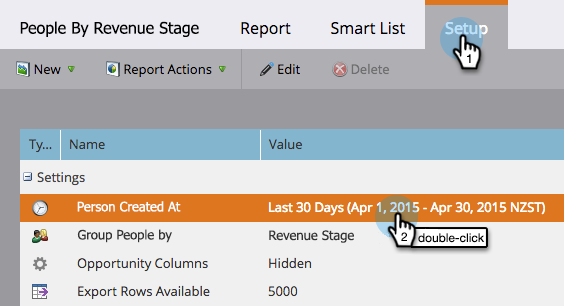
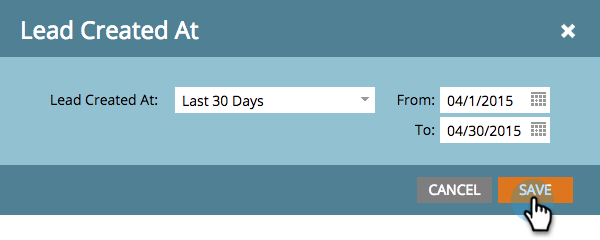

# Bericht zu Personen nach Umsatzschritt {#people-by-revenue-stage-report}

Sie können einen Bericht erstellen, der anzeigt, in welchem Stadium Ihres Umsatzzyklusmodells sich Ihre Mitarbeiter befinden. Der Bericht enthält alle Phasen des angegebenen Modells, solange ein Personensaldo für den angegebenen Datumsbereich des Berichts vorhanden ist.

>[!AVAILABILITY]
>
>Nicht alle Marketo-Editionen enthalten diese Funktion. Weitere Informationen erhalten Sie von Ihrem Account Manager.

1. Navigieren Sie zu **[!UICONTROL Analytics]**.

   

1. Klicken Sie auf den Bericht für **[!UICONTROL Personen nach Umsatzstufe]**.

   

1. Klicken Sie auf **[!UICONTROL Registerkarte]** Setup“. Doppelklicken Sie auf das Feld **[!UICONTROL Person erstellt am]**, um den gewünschten Zeitrahmen für die Berichterstellung festzulegen.

   

1. Bearbeiten Sie den Zeitrahmen und klicken Sie auf **[!UICONTROL Speichern]**.

   

1. Klicken Sie auf **[!UICONTROL Registerkarte]** Bericht“. Jetzt können Sie sehen, in welchem Stadium Ihres Umsatzmodells sich Ihre Mitarbeiter befinden, und sich auf Engpässe konzentrieren.

   
