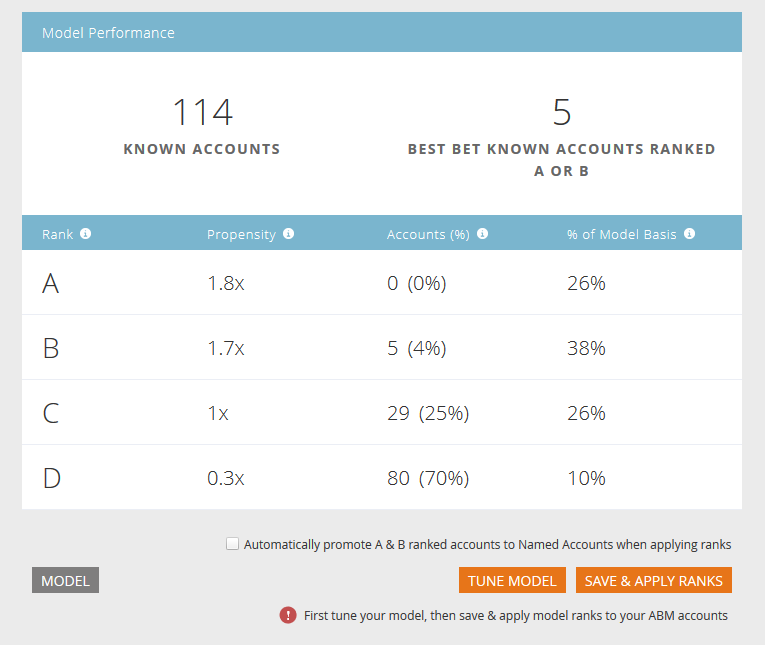

# Ranking und Optimierung von Kontoprofilen {#account-profiling-ranking-and-tuning}

Mit der Kontoprofilerstellung wird Ihr ideales Kundenprofil (ICP) identifiziert, Unternehmen in Ihrer Datenbank werden auf der Grundlage des ICP in eine Rangfolge versetzt und ICP-Indikatordaten zu Konten hinzugefügt, die als benannte Konten beworben werden.

## Modellergebnisse {#model-results}

Die Ergebnisse zeigen Ihnen alle bekannten Konten aufgeschlüsselt nach Klassen. A ist die höchste Klasse, D die niedrigste.

Obwohl optional, empfehlen wir, das Kontrollkästchen Automatisch bewerben zu aktivieren, da dadurch eine Tonne Zeit eingespart wird. Wenn Sie jedoch jedes Konto durchgehen und [manuell hinzufügen](/help/marketo/product-docs/target-account-management/target/named-accounts/discover-accounts.md#discover-crm-accounts) möchten, lassen Sie das Kästchen einfach deaktiviert.

<table> 
 <tbody> 
  <tr> 
   <td><strong>Rang</strong></td> 
   <td> 
    

      Kontorang basierend auf dem Idealen Kundenprofil. A ist am besten geeignet, D am wenigsten geeignet. 
    
</td> 
  </tr> 
  <tr> 
   <td><strong>Kauflust##</strong></td> 
   <td> 
    

      Geschätzter Anstieg der Konversionsrate im Vergleich zu einer nicht auf dem VPI basierenden Kontoauswahl. 
    
</td> 
  </tr> 
  <tr> 
   <td><strong>Konten (%)</strong></td> 
   <td> 
    

      Prozentsatz der Konten in Modelleingaben mit diesem Rang. 
    
</td> 
  </tr> 
  <tr> 
   <td><strong>% der Modellgrundlage</strong></td> 
   <td> 
    

      Prozentsatz der Konten auf Modellbasis mit diesem Rang. 
    
</td> 
  </tr> 
 </tbody> 
</table>

## Modellabstimmung {#model-tuning}

Klicken Sie auf der Registerkarte Modell auf die Schaltfläche Modell anpassen .

Es gibt mehrere Registerkarten, aus denen Sie eine detaillierte Anpassung durchführen können.

**Indikatorkategorien**

<table> 
 <tbody> 
  <tr> 
   <td><strong>Konformität</strong></td> 
   <td> 
    

      Zertifizierungen, Compliance-bezogene Positionen/Einstellungen. 
    
</td> 
  </tr> 
  <tr> 
   <td><strong>Aktivitäten</strong></td> 
   <td> 
    

      Betriebsbezogene Positionen/Einstellungen. 
    
</td> 
  </tr> 
  <tr> 
   <td><strong>HR</strong></td> 
   <td> 
    

      HR- oder Payroll-Software, HR-bezogene Positionen/Vermietung.
    
</td> 
  </tr> 
  <tr> 
   <td><strong>Ingenieurwesen</strong></td> 
   <td> 
    

      Technologien, Frameworks, ingenieurbezogene Positionen/Einstellungen. 
    
</td> 
  </tr> 
  <tr> 
   <td><strong>Vertrieb</strong></td> 
   <td> 
    

      Lösungen und Software für Vertrieb, Verkaufsstellen/Anmietung. 
    
</td> 
  </tr> 
  <tr> 
   <td><strong>Absicht</strong></td> 
   <td> 
    

      Intent-Indikatoren. 
    
</td> 
  </tr> 
  <tr> 
   <td><strong>IT</strong></td> 
   <td> 
    

      Hardware- und Software-Lösungen, Technologien, IT-bezogene Positionen/Einstellungen.
    
</td> 
  </tr> 
  <tr> 
   <td><strong>Finanzwesen</strong></td> 
   <td> 
    

      Finanzsoftware, finanzbezogene Positionen/Anmietung. 
    
</td> 
  </tr> 
  <tr> 
   <td><strong>Marketing</strong></td> 
   <td> 
    

      Marketing-Technologien und -Software, Marketing-bezogene Positionen/Einstellungen. 
    
</td> 
  </tr> 
  <tr> 
   <td><strong>Unternehmen</strong></td> 
   <td> 
    

      Forbes- oder Inc-Listen oder Geschäftspartnerschaften. 
    
</td> 
  </tr> 
  <tr> 
   <td><strong>Kundenerlebnis und Kundenbeziehungen</strong></td> 
   <td> 
    

      Kundenerfolg und Positionen/Einstellung für Kundenbeziehungen.
    
</td> 
  </tr> 
 </tbody> 
</table>

Bewegen Sie den Mauszeiger über die QuickInfos, um eine Beschreibung der einzelnen Spalten zu erhalten.

Klicken Sie auf die Dropdown-Liste ICP-Indikator hinzufügen , um weitere Indikatoren in Ihr Modell einzufügen.

Wenn Sie das Feld &quot;Export&quot;aktivieren, wird der ICP-Indikator auf der Detailseite &quot;Named Account&quot;(Spezifisches Konto) angezeigt. Außerdem können Sie den ausgewählten ICP-Indikator als Begrenzungen in [benannten Kontofiltern](/help/marketo/product-docs/target-account-management/engage/account-filters.md) verwenden.

>[!NOTE]
>
>ICP-Indikatoren werden als Begrenzungen in Filtern und Triggern des Typs **Mitglied des benannten Kontos** einbezogen.

Die Indikatorgewichtung steuert die Wichtigkeitsstufe, die jeder Indikator in Ihrem Modell erhält.

Klicken Sie auf Modell aktualisieren , damit diese Änderungen wirksam werden.

Wenn Sie das Anpassen Ihres Modells abgeschlossen haben (nachdem Sie es aktualisiert haben), kehren Sie zur Registerkarte &quot;Modellergebnisse&quot;zurück und klicken Sie auf **Ränge speichern und anwenden**.

