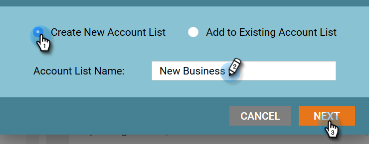
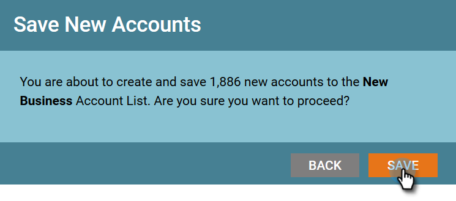

# Erkennung eines neuen Kontos {#new-account-discovery}

Die Erkennung neuer Konten kann Ihnen dabei helfen, neue Konten zu finden, die angesprochen werden sollen, indem Sie KI-gestützte Empfehlungen aus Ihrem idealen Kundenprofil verwenden.

>[!IMPORTANT]
>
>Ab 2025 ist die Kontoprofilerstellung für neue Benutzer nicht mehr verfügbar. Dies funktioniert weiterhin für bestehende Benutzer.

>[!PREREQUISITES]
>
>[Einrichten der Kontoprofilerstellung](/help/marketo/product-docs/target-account-management/account-profiling/setting-up-account-profiling.md)

>[!TIP]
>
>Es wird empfohlen, auf die Schaltfläche **Vorhandene Konten aktualisieren** zu klicken, bevor Sie eine neue Kontosuche durchführen, um sicherzustellen, dass Sie die neuesten Daten anzeigen. Dieses Update kann bis zu 24 Stunden dauern.

1. Klicken Sie in My Marketo **[!UICONTROL Target Account Management]**.

   

1. Klicken Sie auf **[!UICONTROL Registerkarte]** Kontoprofilerstellung“.

   

1. Klicken Sie auf die **[!UICONTROL Neue Konten]**.

   

   >[!NOTE]
   >
   >[!UICONTROL Neue Konten] zeigt eine Liste von Konten an, die noch nicht zu Ihren Konten in TAM gehören. Hierbei handelt es sich um Konten, die basierend auf von Ihnen ausgewählten Filtern neu für Sie sein können.

1. Wählen Sie alle anwendbaren Filter aus (dieser Teil kann umfassend angepasst werden, im Folgenden finden Sie nur ein Beispiel, um das Filtern zu demonstrieren).

   

1. Klicken **[!UICONTROL unten rechts auf]** Seite auf „Alle speichern und Liste erstellen“.

   

   >[!NOTE]
   >
   >Wenn Sie nur einige Konten sehen, die Sie möchten, haben Sie die Möglichkeit, einzelne Konten anzuklicken und **Ausgewählte Konten speichern** zu klicken.

1. Sie können Ihre Liste zu einer eigenen neuen Kontoliste machen oder sie zu einer vorhandenen hinzufügen. In diesem Beispiel erstellen wir ein neues.

   

   >[!NOTE]
   >
   >Um sie in einer bestehenden Kontoliste zu speichern, wählen Sie diese Option aus, klicken Sie auf die Dropdown-Liste, wählen Sie die gewünschte Kontoliste aus und klicken Sie auf **[!UICONTROL Weiter]**.

1. Klicken Sie auf **[!UICONTROL Speichern]**.

   

   >[!NOTE]
   >
   >Sie können nur bis zu 5.000 Konten gleichzeitig speichern. Wenn Ihre Suche 10.000 Ergebnisse liefert, müssen Sie die ersten (obersten) 5.000 speichern, dann die Filter zurücksetzen und die nächsten 5.000 speichern. Das **Gesamtkonto** Limit beträgt eine Million.

1. Klicken Sie auf **[!UICONTROL OK]**.

   

   >[!TIP]
   >
   >Nachdem Ihre Konten gespeichert wurden, können Sie eine [übereinstimmende Zielgruppe auf [!DNL LinkedIn]](/help/marketo/product-docs/target-account-management/target/create-an-account-matched-audience-on-linkedin.md) verwenden, um sie anzusprechen.
