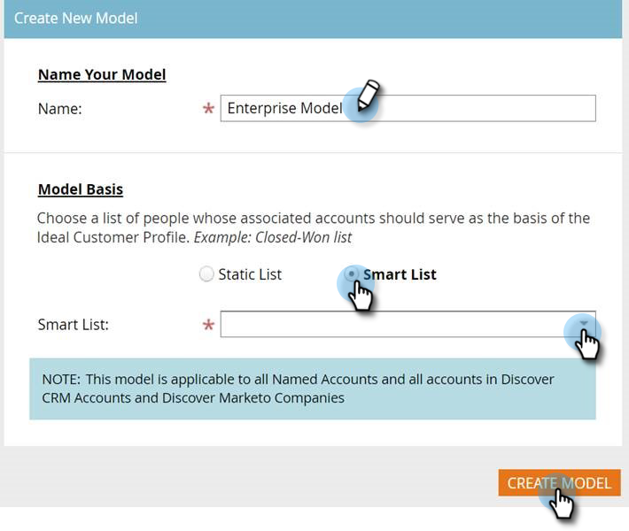

# Einrichten der Kontoprofilerstellung {#setting-up-account-profiling}

Führen Sie diese Schritte aus, um mit der Verwendung der Kontoprofilerstellung zu beginnen.

>[!IMPORTANT]
>
>Ab 2025 ist die Kontoprofilerstellung für neue Benutzer nicht mehr verfügbar. Dies funktioniert weiterhin für bestehende Benutzer.

>[!CAUTION]
>
>Die folgenden Felder dürfen **nicht** ausgeblendet werden, damit die Kontoprofilierung ordnungsgemäß funktioniert.
>
>* Website
>* Unternehmen
>* E-Mail
>* Land
>
>Hier erfahren Sie, wie [ ein Feld ](/help/marketo/product-docs/administration/field-management/hide-and-unhide-a-field.md#unhide-a-field).

1. Öffnen Sie in My Marketo **Target Account Management**.

   

1. Klicken Sie auf **Registerkarte** Kontoprofilerstellung“.

   

1. Die Registerkarte Modell ist standardmäßig geöffnet. Klicken Sie **Erste Schritte**.

   

1. Geben Sie Ihrem Modell einen Namen und wählen Sie den Listentyp/die Liste der Personen aus, die als Grundlage für das Idealkundenprofil (Ideal Customer Profile, ICP) dienen sollen. Klicken Sie **Abgeschlossen** auf Modell erstellen.

   

1. Ihr Modell beginnt mit seiner Erstellung. Es kann eine Weile dauern, aber keine Sorge, Sie werden benachrichtigt, wenn es erledigt ist.

   

1. Um die Ergebnisse Ihres Modells anzuzeigen, klicken Sie auf **Modellergebnis anzeigen**.

   

   Ihr Modell wird jetzt erstellt.

   

   >[!TIP]
   >
   >Nachdem Ihr Modell erstellt wurde, [erfahren Sie, wie Sie es optimieren können](/help/marketo/product-docs/target-account-management/account-profiling/account-profiling-ranking-and-tuning.md).
