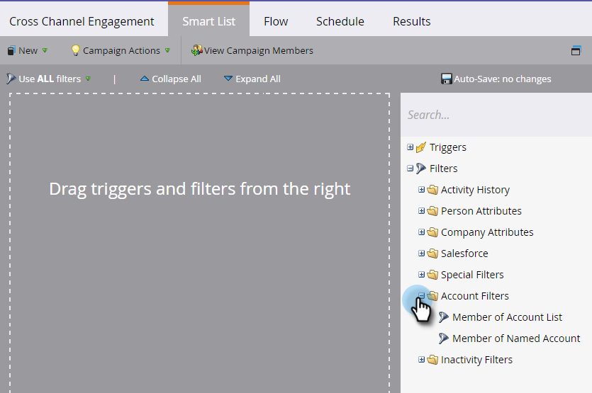

# [!UICONTROL Kontofilter] {#account-filters}

Identifizieren und interagieren Sie benannte Konten und die darin enthaltenen Personas mithilfe neuer kontozentrierter Filter.

## TAM-Filter {#tam-filters}

1. Wählen Sie Ihre Smart-Kampagne aus und klicken Sie auf **[!UICONTROL Smart-Liste]**.

   

1. Klicken Sie auf **+**, um den Ordner **[!UICONTROL Kontofilter]** zu erweitern.

   

1. Ziehen Sie die gewünschten Filter auf die Arbeitsfläche.

   

## [!UICONTROL Mitglied der Kontenliste] {#member-of-account-list}

Um diesen Filter zu verwenden, klicken Sie auf **[!UICONTROL Dropdown-]** „Kontoliste“.

…und wählen Sie Ihre gewünschte(n) Account-Liste(n) aus.

>[!NOTE]
>
>Für den Filter [!UICONTROL Mitglied der Kontenliste] gibt es nur einen Qualifizierer: &quot;[!UICONTROL is]&quot; - Zusätzliche Qualifizierer (wie „is not“ und „is any„) sind nicht verfügbar.

## [!UICONTROL Mitglied des spezifischen Kontos] {#member-of-named-account}

Wählen Sie zunächst einen Qualifizierer aus. **[!UICONTROL is]** für ein bestimmtes benanntes Konto oder **[!UICONTROL is any]** für ein beliebiges benanntes Konto.

Klicken Sie auf die Dropdown-Liste Benanntes Konto…

…und wählen Sie Ihr(e) gewünschte(n) Konto(e).

Wenn Sie den Qualifizierer &quot;[!UICONTROL is any] verwenden, können Sie [einschränkungen](/help/marketo/product-docs/core-marketo-concepts/smart-lists-and-static-lists/using-smart-lists/add-a-constraint-to-a-smart-list-filter.md) verwenden, um Ihre Suchergebnisse einzugrenzen. Fügen Sie so viele hinzu, wie Sie möchten!

Legen Sie &quot;[!UICONTROL Untergeordnete Elemente einschließen] auf **[!UICONTROL false]** fest, wenn Sie nur Mitglieder aus dem einzelnen Konto der obersten Ebene möchten. Wählen **[!UICONTROL true]**, wenn Mitglieder aus allen untergeordneten Konten einbezogen werden sollen.

>[!MORELIKETHIS]
>
>[Account-Trigger ](/help/marketo/product-docs/target-account-management/engage/account-triggers.md)
