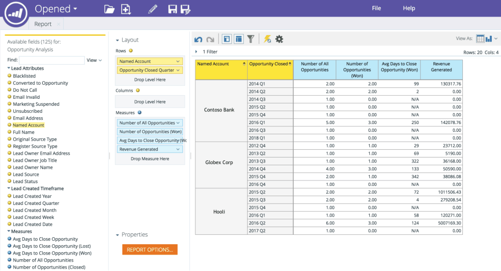

# Dimension „Benanntes Konto“ in RCA {#named-account-dimension-in-rca}

Erstellen Sie umsatzbasierte Berichte mithilfe der TAM-spezifischen Dimension Benanntes Konto in der Umsatzzyklusanalyse.

>[!NOTE]
>
>**Dimensionen** - Attribute (dargestellt durch gelbe Punkte), die unterschiedliche Ansichten der Kennzahlen wiedergeben.

>[!NOTE]
>
>Die Dimension „Benanntes Konto“ in RCA kann verwendet werden, um die Wirkung zielgerichteter Konten auf das Endergebnis zu messen (z. B. Umsatz, generierte Pipeline oder Beschleunigung des Verkaufszyklus). Diese Dimension kann auch verwendet werden, um zu ermitteln, welche Programme bei benannten Konten eine gute Leistung erbracht haben und welche nicht.

Die folgenden Berichte haben Zugriff auf die Dimension Benanntes Konto :

* E-Mail-Analyse
* Lead-Analyse
* Opportunity-Analyse
* Analyse der Programmzugehörigkeit

>[!NOTE]
>
>Im Folgenden finden Sie einige Beispiele für Marketo TAM in der Umsatzzyklusanalyse.

Pipeline-Beschleunigung in benannten Konten

Kanaleffektivität und -erfolg nach benannten Konten

Wirksamkeit des Programms und Auswirkungen auf das Endergebnis

Abdeckung von hochwertigen Leads und Interaktionen in benannten Konten

