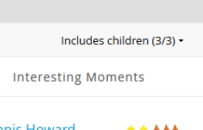

# Einblicke zu benannten Konten {#named-account-insights}

Das Dashboard für benannte Konten bietet eine 360-Grad-Ansicht eines Zielkontos.

## Dashboard {#dashboard}

Das Dashboard aggregiert wichtige Einblicke auf Kontoebene von allen Personen in einem benannten Konto, sodass nicht jede Person aufgerufen werden muss, um ihren Fortschritt zu bewerten. Sie können mit „E-Mail-Einblicke“ einen tieferen Einblick in [ E-Mail-Aktivität ](/help/marketo/product-docs/reporting/email-insights/filtering-in-email-insights.md#account-based-marketing).

>[!NOTE]
>
>Diagramme zeigen Einblicke aus den letzten 90 Tagen.

**Kundeninteraktion im**: Klicken Sie auf die **Anzeigen** Dropdown-Liste auf der rechten Seite, um zu ändern, wonach Sie suchen. Zusätzlich zur Kontenbewertung können Sie den Umsatz nach Umsatz anzeigen…

…oder Pipeline.

<table> 
 <tbody> 
  <tr> 
   <td><strong>Kontobewertung</strong></td> 
   <td>
Sehen Sie die wöchentliche Interaktion basierend auf allen Kontobewertungen an, die Sie in Admin erstellt haben. Sie können diese Kontobewertungen nebeneinander vergleichen. Um die wöchentliche Interaktion zu bestimmen, verwenden wir die maximale Interaktion an jedem beliebigen Wochentag.
</td> 
  </tr> 
  <tr> 
   <td><strong>Vertriebskette</strong></td> 
   <td>Zeigen Sie die Pipeline im Zeitverlauf an. Um die Pipeline im Zeitverlauf nach Woche zu bestimmen, nehmen wir die Pipeline am letzten Tag.</td> 
  </tr> 
  <tr> 
   <td><strong>Umsatz</strong></td> 
   <td>Umsatz im Zeitablauf anzeigen. Um den Umsatz im Zeitverlauf nach Woche zu ermitteln, berechnen wir die Summe aller in dieser Woche erzielten Einnahmen.</td> 
  </tr> 
 </tbody> 
</table>

**Interessante Momente**

Wenn Sie Benutzenden von Marketo Sales Insight zur Verfügung stehen, können Sie die interessanten Momente anzeigen, die auf Kontoebene aggregiert wurden.

**Top-Personen**

Diese Personen werden anhand von Prioritäten berechnet, die auf der Neuigkeit oder Dringlichkeit basieren, die von Personen mit benannten Konten (wie [Best Bets](/help/marketo/product-docs/marketo-sales-insight/msi-for-salesforce/features/stars-and-flames/priority-urgency-relative-score-and-best-bets.md) in Sales Insight) oder von den vom Benutzer definierten Bewertungen angezeigt wird. **Priorität** ist nur für Benutzende von Marketo Sales Insight verfügbar.

**Enthält untergeordnete Elemente**

Klicken Sie **Einschließlich untergeordneter**), um die untergeordneten Konten des ausgewählten benannten Kontos anzuzeigen und auszuwählen und ihre aggregierten Analysen anzuzeigen.

>[!NOTE]
>
>Bei der Auswahl von Konten können Sie entweder „Alle auswählen“ oder einzeln bis zu 100 auswählen.

## Hierarchy {#hierarchy}

Hier wird angezeigt, wo sich das ausgewählte benannte Konto in Bezug auf seine Hierarchie befindet.

## Opportunitys {#opportunities}

Eine aggregierte Ansicht aller offenen Opportunitys auf Kontoebene, die Marketing-Teams dabei unterstützt, sich auf das Schließen spezifischer Opportunitys zu konzentrieren.

## Potenzielle Personen {#potential-people}

Der Lead-Konto-Abgleich verwendet Fuzzy-Logik, um schwache Übereinstimmungen zu finden, die auf der Registerkarte „Mögliche Personen“ aufgelöst werden können.

>[!NOTE]
>
>Um eine der aufgelisteten Personen hinzuzufügen, wählen Sie diese aus und klicken Sie auf **Personen hinzufügen**.

## Verwendet von {#used-by}

Auf dieser Registerkarte wird angezeigt, welche Smart-Kampagnen, Web-Kampagnen, Smart-Listen oder Berichte derzeit auf bestimmte benannte Konten oder Account-Listen verweisen.

## Kundenteam {#account-team}

Auf dieser Registerkarte können Sie Mitglieder des Account-Teams anzeigen, Mitglieder hinzufügen/entfernen und sogar einen Kontoinhaber zuweisen.

>[!NOTE]
>
>Klicken Sie auf **Dropdown-** „Account-Team-Aktionen“, um Kontomitglieder hinzuzufügen/zu entfernen oder einen Kontoinhaber zuzuweisen.

## ICP-Indikatoren {#icp-indicators}

Zeigen Sie die ICP-Indikatoren an, die Sie beim [ des Modells für den Export ausgewählt ](/help/marketo/product-docs/target-account-management/account-profiling/account-profiling-ranking-and-tuning.md#model-tuning).

