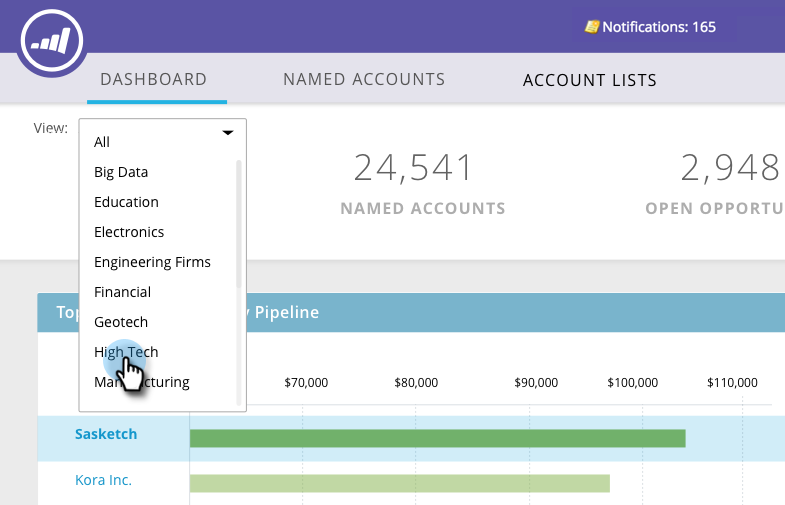
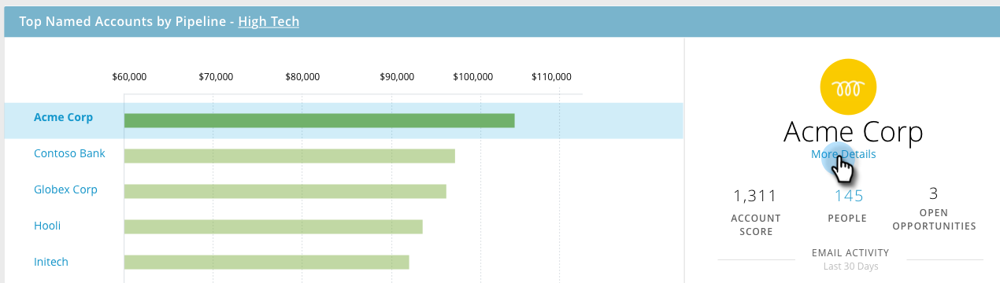

# TAM-Haupt-Dashboard {#tam-main-dashboard}

Das Haupt-Dashboard bietet eine Zusammenfassung Ihrer Target-Kontoverwaltungsbemühungen. Sie können die Zielkonten oder Kontolisten sehen, die erfolgreich sind, und diejenigen, die mehr Aufmerksamkeit benötigen.

Um nach Kontoliste zu filtern, klicken Sie auf das Dropdown-Menü Ansicht ...

...und wählen Sie aus. In diesem Beispiel wählen wir unsere &quot;High-Tech&quot;-Kontoliste.

Um das Dashboard der [Kontoliste](/help/marketo/product-docs/target-account-management/measure/account-list-insights.md#account-list-dashboard) anzuzeigen, klicken Sie auf den Namen der von Ihnen ausgewählten Kontoliste..

... und das Dashboard wird geladen.

Wenn Sie das Dashboard &quot;Kontoliste&quot;nicht anzeigen, sondern einen Drilldown in ein benanntes Konto durchführen möchten, klicken Sie unter dessen Namen auf **Mehr Details** ...

... und sehen Sie sich die Einblicke des [benannten Kontos](/help/marketo/product-docs/target-account-management/measure/named-account-insights.md) an.

