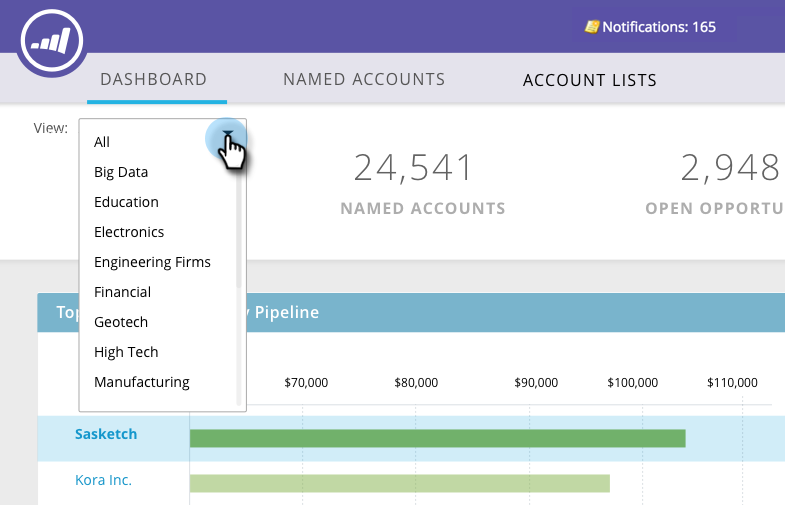

# TAM-Haupt-Dashboard {#tam-main-dashboard}

Das Haupt-Dashboard bietet eine Zusammenfassung Ihrer [!UICONTROL Target-Kontoverwaltung]-Maßnahmen. Sie können die Zielkonten oder Account-Listen sehen, die Erfolg zeigen, sowie die Konten, die mehr Aufmerksamkeit benötigen.

Um nach Kontoliste zu filtern, klicken Sie auf **[!UICONTROL Dropdown-]** Ansicht…“

…und eine Auswahl treffen. In diesem Beispiel wählen wir unsere &quot;**[!UICONTROL High Tech]**-Kontoliste aus.

Um das Dashboard [Kontenliste](/help/marketo/product-docs/target-account-management/measure/account-list-insights.md#account-list-dashboard) anzuzeigen, klicken Sie auf den Namen der ausgewählten Kontenliste…

…und das Dashboard wird geladen.

Wenn Sie nicht das Dashboard der Kontenliste anzeigen möchten, sondern ein benanntes Konto aufschlüsseln möchten, klicken Sie auf **[!UICONTROL Weitere Details]** unter seinem Namen…

…und die Einblicke des [benannten Kontos anzeigen](/help/marketo/product-docs/target-account-management/measure/named-account-insights.md).

