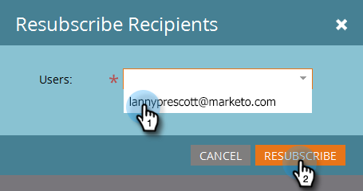

# TAM-Berichteinstellungen {#tam-report-setup}

Der TAM-Verkaufsbericht ist eine wöchentliche, personalisierte E-Mail, die an das Account-Team gesendet wird.

## Berichtseinstellungen {#report-setup}

1. Klicks **Admin**.

   

1. Klicks **Verwaltung von Target-Konten**.

   

1. Klicken Sie unter &quot;Wöchentlicher Bericht&quot;auf **Bearbeiten**.

   

1. Klicken Sie auf **Tag** und wählen Sie den Wochentag aus, an dem die Empfänger die E-Mail erhalten sollen.

   

1. Um das Layout Ihrer E-Mail zu bestimmen, klicken Sie auf das **Sortieren nach** und wählen Sie aus.

   

1. Überprüfen Sie die **Benutzer** aktivieren, klicken Sie auf das Dropdown-Menü und wählen Sie aus, an wen die E-Mail gesendet werden soll.

   

   >[!NOTE]
   >
   >Benachrichtigungen werden nur an Kontoinhaber oder Teammitglieder gesendet.

1. Klicks **Speichern**.

   

Und das ist es!

## Abmeldung {#how-to-unsubscribe}

Jeder Bericht enthält die Option zum Opt-out. Klicken Sie dazu einfach auf **Abmelden** unten in der E-Mail.

## Zurücksetzen der Anmeldung {#how-to-resubscribe}

1. Klicks **Admin**.

   

1. Klicks **Verwaltung von Target-Konten**.

   

1. Klicken Sie unter &quot;Wöchentlicher Bericht&quot;auf die Zahl, die als Abgemeldet angezeigt wird.

   

1. Klicken Sie auf **Benutzer** angezeigt.

   

1. Wählen Sie den Benutzer aus, den Sie erneut per E-Mail erhalten möchten, und klicken Sie auf **Resubscribe**.

   
