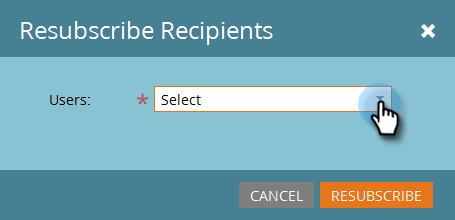

# TAM-Bericht einrichten {#tam-report-setup}

Der TAM-Verkaufsbericht ist eine wöchentliche, personalisierte E-Mail, die an das Konto-Team gesendet wird.

## Berichteinrichtung {#report-setup}

1. Klicken Sie auf **[!UICONTROL Admin]**.

   

1. Klicken Sie **[!UICONTROL Target-Kontoverwaltung]**.

   

1. Klicken [!UICONTROL &#x200B; unter &quot;] Bericht“ auf **[!UICONTROL Bearbeiten]**.

   

1. Klicken Sie auf **[!UICONTROL Tag]** und wählen Sie den Wochentag aus, an dem die Empfänger die E-Mail erhalten sollen.

   

1. Um das Layout Ihrer E-Mail zu bestimmen, klicken Sie auf **[!UICONTROL Dropdown]** Sortieren nach“ und wählen Sie aus.

   

1. Aktivieren Sie das **[!UICONTROL Benutzer]**, klicken Sie dann auf die Dropdown-Liste und wählen Sie aus, wer die E-Mail erhalten soll.

   

   >[!NOTE]
   >
   >Benachrichtigungen werden nur an Kontoinhaber oder Teammitglieder gesendet.

1. Klicken Sie auf **[!UICONTROL Speichern]**.

   

Und das war&#39;s!

## Abmelden {#how-to-unsubscribe}

Für jeden Bericht gibt es die Option zum Opt-out. Klicken Sie dazu einfach auf **[!UICONTROL Abmelden]** am Ende der E-Mail.

## Erneutes Abonnieren {#how-to-resubscribe}

1. Klicken Sie auf **[!UICONTROL Admin]**.

   

1. Klicken Sie **[!UICONTROL Target-Kontoverwaltung]**.

   

1. Klicken Sie unter [!UICONTROL Wöchentlicher Bericht] auf die als „Abgemeldet[!UICONTROL &#x200B; angegebene &#x200B;].

   

1. Klicken Sie auf **[!UICONTROL Dropdown-]** Benutzer“.

   

1. Wählen Sie den Benutzer aus, den Sie erneut E-Mails erhalten möchten, und klicken Sie auf **[!UICONTROL Erneut abonnieren]**.

   
