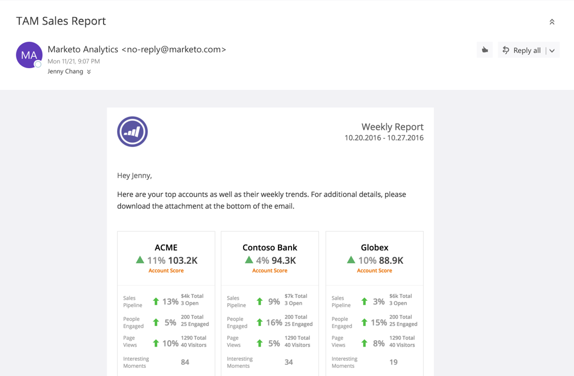

# TAM-Verkaufsbericht {#tam-sales-report}

Erhalten Sie eine wöchentliche E-Mail mit Ihren wichtigsten Konten und deren wöchentlichen Trends.

>[!NOTE]
>
>Erfahren Sie (hier[, wie Sie diesen Bericht ](/help/marketo/product-docs/target-account-management/measure/tam-report-setup.md).

Der Bericht teilt:

* Benannte Konten sortiert nach dem von Ihnen ausgewählten Kontostand
* Am häufigsten engagierte Personen
* Wichtige Trends und interessante Momente
* Ein Link zum Herunterladen einer CSV-Datei mit zusätzlichen Details

## Verkaufsberichtschlüssel {#sales-report-key}

<table> 
 <tbody> 
  <tr> 
   <td><strong>Kontobewertung</strong></td> 
   <td> 
    

      Wöchentlicher Trend nach Kontobewertung (im Setup ausgewählt), gefolgt vom aktuellen Kontowert 
    
</td> 
  </tr> 
  <tr> 
   <td><strong>Vertriebspipeline</strong></td> 
   <td> 
    

      Wöchentlicher Trend nach Pipeline, gefolgt von der Gesamtzahl der aktuellen Pipeline und der Anzahl der offenen Opportunities 
    
</td> 
  </tr> 
  <tr> 
   <td><strong>Seitenansichten</strong></td> 
   <td> 
    

      Wöchentlicher Trend der Seitenansichten, gefolgt von der Gesamtzahl der Seitenansichten und der Anzahl der Unique Visitors 
    
</td> 
  </tr> 
  <tr> 
   <td><strong>Interessante Momente</strong></td> 
   <td> 
    

      Gesamtzahl der interessanten Momente während der Woche 
    
</td> 
  </tr> 
 </tbody> 
</table>
