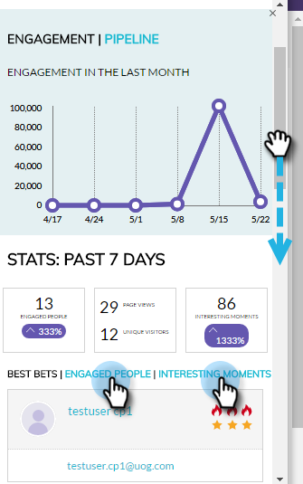

# Übersicht über das Konto-Insight-Plug-in {#account-insight-plug-in-overview}

Account Insight ist ein Chrome-Plug-in, das umsetzbare TAM-Daten und Kontoeinblicke für Ihre Verkaufsteams anzeigt, sodass diese Ihre Konten effektiver binden können.

>[!AVAILABILITY]
>
>* Account Insight ist für alle Kunden mit TAM und Marketo Sales Insight enthalten. Für Kunden, die nur über TAM verfügen, ist Account Insight als erworbenes Add-on verfügbar. Jeder Kunde ist auf 250 Konto Insight-Plätze beschränkt. Wenden Sie sich für weitere Informationen an Ihren Vertriebsmitarbeiter. Es ist nicht für Kunden verfügbar, die nicht über TAM verfügen.
>
>* Dieses Plug-in ist derzeit nicht mit der [Adobe-Identitätsauthentifizierung](/help/marketo/product-docs/administration/marketo-with-adobe-identity/adobe-identity-management-overview.md){target="_blank"} kompatibel.

>[!CAUTION]
>
>Das Account Insight-Plug-in funktioniert nicht bei Abonnements, für die [Nur-SSO](/help/marketo/product-docs/administration/additional-integrations/restrict-user-login-to-sso-only.md) (Single Sign-on) aktiviert ist.

>[!CAUTION]
>
>Der CRM-Kontext funktioniert für Salesforce, wenn das Plug-in über ein Konto, einen Lead oder einen Kontakt gestartet wird. Der CRM-Kontext funktioniert für Dynamics nicht, wenn das Plug-in über ein Konto, einen Lead oder einen Kontakt gestartet wird. Für Dynamics-Benutzer wird die Verwendung des Kontoeinblick-Plug-ins empfohlen.

## Genannte Konten {#named-accounts}

Sehen Sie die benannten Konten in der Reihenfolge ihres Rangs untereinander. Diese Liste steht nur Kontoinhabern zur Verfügung. Der Kundenbetreuer wird in Kürze unterstützt.

Um Details zu einem benannten Konto anzuzeigen, klicken Sie auf seinen Namen ...

... und die Übersicht wird angezeigt.

Sehen Sie interessante Momente mithilfe der Dropdown-Liste.

Scrollen Sie nach unten, um die besten Wetten zu sehen. Interessante Momente sind auch hier, zusammen mit engagierten Leuten.

Klicken Sie auf den Namen einer Person ...

...und sehen Sie ihre Aktivitäten.

Sie können die Ansicht auch von Interaktion zu Pipeline wechseln.

Um das angegebene Konto zu verlassen, klicken Sie auf das X oben rechts.

## Aktivitäts-Feed {#activity-feed}

Der Aktivitäts-Feed zeigt die letzten Aktivitäten an, die sieben Tage zurückgehen.

Klicken Sie auf das Dropdown-Menü **Filter** , um nach verschiedenen Aktivitätstypen zu filtern.

Mehrere Elemente können angeklickt werden. Klicken Sie auf das spezifische Konto, um dessen Details anzuzeigen. Klicken Sie auf den Namen des Benutzers, um dessen Aktivität anzuzeigen. Klicken Sie auf Mehr Aktivitäten , um weitere Aktivitäten anzuzeigen.

Ziemlich cooles Zeug!

>[!MORELIKETHIS]
>
>[Einrichten von Konto Insight](/help/marketo/product-docs/target-account-management/setup-tam/set-up-account-insight.md)
