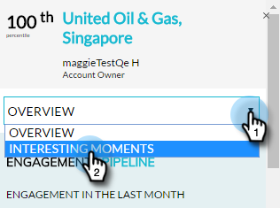
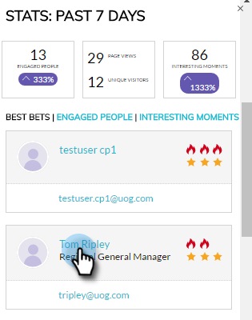

# [!DNL Account Insight]-Plug-in - Übersicht {#account-insight-plug-in-overview}

[!DNL Account Insight] ist ein [!DNL Chrome]-Plug-in, das Ihren Vertriebsteams umsetzbare TAM- und Account-Insights zur Verfügung stellt, sodass sie effektiver mit Accounts interagieren können.

>[!AVAILABILITY]
>
>* Account Insight ist für alle Kunden enthalten, die sowohl TAM als auch Marketo Sales Insight haben. Für Kunden, die nur über TAM verfügen, ist Account Insight als erworbenes Add-on verfügbar. Jeder Kunde hat maximal 250 Lizenzen für Account Insight. Weitere Informationen erhalten Sie von Ihrem Vertriebsmitarbeiter. Sie ist nicht für Kunden verfügbar, die kein TAM haben.
>
>* Dieses Plug-in ist derzeit nicht mit der [Adobe Identity-](/help/marketo/product-docs/administration/marketo-with-adobe-identity/adobe-identity-management-overview.md){target="_blank"} kompatibel.

>[!CAUTION]
>
>Das [!DNL Account Insight]-Plug-in funktioniert nicht bei Abonnements, bei denen [SSO-only](/help/marketo/product-docs/administration/additional-integrations/restrict-user-login-to-sso-only.md) (Single Sign-on) aktiviert ist.

>[!CAUTION]
>
>Der CRM-Kontext funktioniert für Salesforce, wenn das Plug-in über ein Konto, einen Lead oder einen Kontakt gestartet wird. Der CRM-Kontext funktioniert nicht für Dynamics, wenn das Plug-in über ein Konto, einen Lead oder einen Kontakt gestartet wird. Für Dynamics-Benutzer wird die Verwendung des Plug-ins [!DNL Account Insight] empfohlen.

## Benannte Konten {#named-accounts}

Siehe benannte Konten nach ihrem Rang untereinander. Diese Liste ist nur für Kontoinhaber verfügbar. Der Support für das Account-Team wird in Kürze verfügbar sein.

Um Details zu einem benannten Konto anzuzeigen, klicken Sie auf den Namen…

…und die Übersicht wird angezeigt.

Sehen Sie interessante Momente mithilfe der Dropdown-Liste.

Scrollen Sie nach unten, um die besten Wetten zu sehen. Interessante Momente sind auch hier, zusammen mit engagierten Menschen.

Klicken Sie auf den Namen einer Person…

…und ihre Aktivitäten sehen.

Sie können die Ansicht auch von **[!UICONTROL Interaktion]** zu **[!UICONTROL Pipeline]** wechseln.

Um das benannte Konto zu verlassen, klicken Sie auf das X oben rechts.

## [!UICONTROL Aktivitäts-Feed] {#activity-feed}

Der Aktivitäts-Feed zeigt die letzten Aktivitäten an, die sieben Tage zurückgehen.

Klicken Sie auf **[!UICONTROL Filter]**, um nach verschiedenen Aktivitätstypen zu filtern.

Mehrere Elemente sind anklickbar. Klicken Sie auf das benannte Konto, um dessen Details anzuzeigen. Klicken Sie auf den Namen der Benutzerin bzw. des Benutzers, um deren Aktivität anzuzeigen. Klicken Sie auf **[!UICONTROL Weitere Aktivitäten]**, um weitere Aktivitäten anzuzeigen.

Ziemlich cooles Zeug!

>[!MORELIKETHIS]
>
>[Einrichten [!DNL Account Insight]](/help/marketo/product-docs/target-account-management/setup-tam/set-up-account-insight.md)
