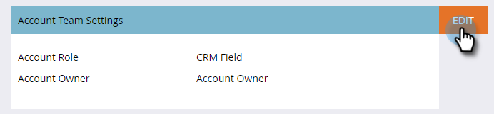

# Konto-Team-Setup {#account-team-setup}

Ein Account-Team ist eine Gruppe von Stakeholdern, die gemeinsam an einem benannten Account arbeiten. Führen Sie die folgenden Schritte aus, um festzulegen, welche CRM-Kontorollen hinzugefügt werden sollen.

1. Klicken Sie auf **Admin**.

   

1. Klicken Sie **Target-Kontoverwaltung**.

   

1. Klicken Sie unter „Account-Team-Mitglieder“ auf **Bearbeiten**.

   

   >[!NOTE]
   >
   >Geben Sie für die Kontorolle einen Namen und ordnen Sie ihn dem gewünschten Benutzer-Lookup-Feld in Ihrem CRM zu.

1. Geben Sie den Namen Ihrer Kontorolle ein und wählen Sie das Feld **CRM** aus. Bis zu 10 hinzufügen.

   

   >[!NOTE]
   >
   >Es kann kein Kontoinhaber ausgewählt werden. Sie wird standardmäßig auf der Kontoebene in Ihrem CRM ausgewählt.

1. Klicken Sie auf **Speichern**, wenn Sie fertig sind.

   

   >[!CAUTION]
   >
   >Wenn Sie eine Aktualisierung vornehmen, kann es einige Zeit dauern, bis die Änderungen in TAM übernommen werden.

   >[!NOTE]
   >
   >* Wenn mehrere CRM-Konten mit unterschiedlichen Kontoinhabern zu einem benannten Konto zusammengeführt werden, wählt Marketo einen „Kontoinhaber“ aus und fügt andere Kontoinhaber als „Kontoinhaber“ hinzu
   >
   >* Wenn ein CRM-Rollenfeld später umbenannt oder gelöscht wird, hört Marketo TAM mit der Synchronisierung der aktualisierten Werte auf, bis die Benutzerin bzw. der Benutzer die Einrichtung in TAM manuell aktualisiert
