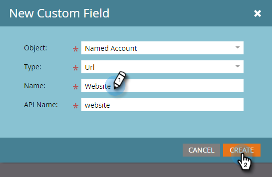

# Erstellen eines benutzerdefinierten Felds für die CRM-Erkennung {#create-a-custom-field-for-crm-discovery}

Fügen Sie benutzerdefinierte Felder zu den Konten hinzu, ordnen Sie sie Ihrem CRM-System zu und verwenden Sie sie zur CRM-Kontoerkennung in Marketo.

1. Klicken Sie auf **Admin**.

   

1. Klicken Sie auf **Feldverwaltung** und dann auf **Neues benutzerdefiniertes Feld**.

   

1. Klicken Sie auf die Dropdownliste **Objekt** und wählen Sie **Spezifisches Konto** aus.

   

1. Klicken Sie auf die Dropdownliste **Typ** und wählen Sie einen Typ aus.

   

1. Geben Sie einen **Namen** ein (der API-Name wird automatisch ausgefüllt) und klicken Sie auf **Erstellen**.

   

1. Nachdem das Feld erstellt wurde, wählen Sie es aus dem Baum auf der rechten Seite aus. Klicken Sie auf die Dropdownliste **Feldaktionen** und wählen Sie **Zu CRM-Feld zuordnen** aus.

   

1. Wählen Sie das CRM-Kontofeld aus, das Sie zuordnen möchten, und klicken Sie auf **Speichern**.

   

   Nach der Synchronisierung erscheint Ihr neues Feld ganz rechts in Ihrem Discover CRM-Raster.

   
