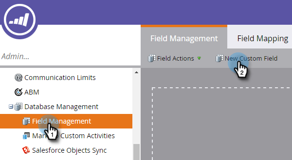

# Benutzerdefiniertes Feld für CRM-Erkennung erstellen {#create-a-custom-field-for-crm-discovery}

Fügen Sie Konten benutzerdefinierte Felder hinzu, ordnen Sie sie Ihrem CRM zu und verwenden Sie sie für die CRM-Kontoerkennung in Marketo.

1. Klicken Sie auf **[!UICONTROL Admin]**.

   

1. Klicken Sie auf **[!UICONTROL Feldverwaltung]** und dann auf **[!UICONTROL Neues benutzerdefiniertes Feld]**.

   

1. Klicken Sie auf die **[!UICONTROL Objekt]** und wählen Sie **[!UICONTROL Benanntes Konto]**.

   

1. Klicken Sie auf **[!UICONTROL Typ]** und wählen Sie einen Typ aus.

   

1. Geben Sie einen **[!UICONTROL Namen]** ein (der API-Name wird automatisch angezeigt) und klicken Sie auf **[!UICONTROL Erstellen]**.

   

1. Nachdem das Feld erstellt wurde, wählen Sie es aus der Baumstruktur auf der rechten Seite aus. Klicken Sie auf die **[!UICONTROL Feldaktionen]** und wählen Sie **[!UICONTROL CRM-Feld zuordnen]**.

   

1. Wählen Sie das CRM-Konto-Feld aus, dem Sie das Konto zuordnen möchten, und klicken Sie auf **[!UICONTROL Speichern]**.

   

   Nach der Synchronisierung wird Ihr neues Feld ganz rechts in Ihrem Discover CRM-Raster angezeigt.

   
